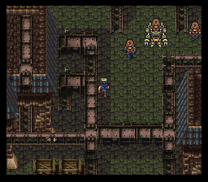
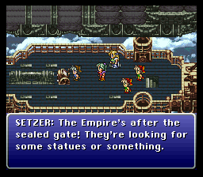
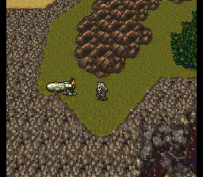
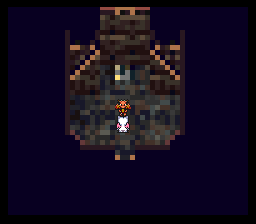

# A semi-casual 100% New Game+ walkthrough

-   Hello and welcome!
-   This walkthrough will take you across Final Fantasy VI in a new and unexpected way, utilizing a number of well known and lesser known glitches as well as some clever routing
-   Let me start off by saying that this is _not_ a guide meant for speedrunners
    -   In fact, playing the game in this order will probably take _longer_ than a regular game
-   It is mostly meant to be a new, fun and mostly different way to play through the events of Final Fantasy VI using "New Game+" mode (more on this later)
    -   Certain parts of the game will become much more difficult, while others will be trivialized
    -   And although we are doing things in a vastly different sequence, we will not skip any content, hence the "100%"
-   Of course, you do not have to copy this walkthrough 1-on-1
    -   Feel free to take some inspiration from it if you're planning to do an unorthodox run of FF6 yourself sometime
-   One of our objectives is to become as powerful as possible _before_ the Floating Continent
    -   Not necessarily in levels, but more so in items, equipment, espers, etc.
-   As part of our journey, we're going to visit a number of World of Ruin locations before we're officially able to go to the World of Ruin
    -   It is in fact "relatively" easy to go to the WoR early with a party of Terra, Locke, Edgar, Sabin, Celes, Cyan and Gau
    -   However, we're going to take a very specific route so we can take Setzer, Mog, Strago, Relm and Shadow along with us as well
-   And for good reasons:
    -   With Setzer, we can get early access to Darril's Tomb
    -   With Mog, we can equip the Moogle Charm to raid otherwise difficult dungeons such as the Fanatics Tower and Kefka's Tower
    -   With Strago/Relm, we can get early access to Ebot's Rock
    -   ... and Shadow is just cool
-   Additionally, this also means we don't have to hold back on leveling any party members while in the early WoR
    -   Otherwise, the remaining party members would join at inflated levels and would miss out on esper bonuses
-   Another major part of this run is that we're going to escape the Narshe mines with the 10 generic moogles during the sequence where you have to defend Terra
    -   We're going to use these moogles to grab a lot of items from the WoB before we even properly begin the game
-   It is worth mentioning that there are some bits and pieces that could be useful if you're going for a low level game (LLG)
    -   For instance, we're taking several of the generic moogles with us to the mine cart ride, so you can avoid getting any forced experience with any permanent party members

---

## Major glitches overview

-   As is obvious from the introduction, there are a number of glitches needed to perform huge sequence breaks like these
-   Most of the setups I'm explaining in this guide are applications or expansions of other documented glitches
-   To keep the walkthrough section itself somewhat streamlined, I'll discuss the most used glitches here, with the sources provided
-   So, before you proceed with my walkthrough, I suggest you familiarize yourself with at least these glitches:

1. The Door Timer Glitch
    - You absolutely need a game with the "Door Timer Glitch" active, otherwise known as a "New Game+"
    - This glitch is incredibly useful in its own right; granting early access to espers like Ragnarok and dungeons like Figaro Castle basement
    - But more importantly, without this glitch, a number of other glitches like the party warping antics and the easy Airship Glitch won't work either
    - More information about this glitch can be found in [this guide by Neerrm](https://docs.google.com/document/d/16D7QRh_G4MydPuYjxhnGaXpfrKeScfNl-Z_W4jIfrwY/edit?tab=t.0)
2. Teleporting when in three party mode
    - I'm not really sure if there's an actual name for this glitch, but it involves warping your characters across a map while you're in the "three party mode"
        - Most notably the Kefka at Narshe sequence, but it can also be done with the 10 moogles a little while earlier
    - This can be done by cycling through your teams, and at the exact moment the Door Timer Glitch would click, you change the lead of your current party
    - When you cycle back to this party, you'll find that they are now at the (not properly initialized) coordinates of the new lead character
    - This can be done to escape the Kefka at Narshe sequence, which is another trick we'll use several times during this run
    - I'm probably not doing a great job at explaining this, so I recommend you watch please watch [this part](https://youtu.be/_fx4p2VSq8k?t=393) of Neerm's YouTube video instead
3. Transfering coordinates between saves
    - This is another way to warp your character's sprite to another location
    - While it does require you to be in a "three party mode", it does not rely on the Door Timer Glitch
    - When you are in "three party mode", and use one of your parties to save your game, it will save the X- and Y- coordinates of your other two parties
    - However, when you select another save file (even without saving over it), and then reset the game, it will load the coordinates of that save file in your memory, even if you continue with your initial save file
    - This effectively means you can arbitrarily store coordinates in one save game, and then load those coordinates in another save game where your parties may not even be on the same map
    - There are a number of setups in this walkthrough that take advantage of this
        - For example, saving your coordinates when one of your parties is standing in a specific spot in Narshe, and then loading those coordinates in another save game where that same party is standing in Zozo, you can warp yourself past the door that requires the Rust-Rid, thus granting early access to Mt. Zozo
        - I actually made [a short demonstration video](https://www.youtube.com/watch?v=5B9CZ0mjz8Y) about this a year ago, just so you know what I mean
4. The (faster) Airship Glitch
    - This is a classic: the original version requires you to save _anywhere_, then play normally until the Floating Continent, jump back onto the airship when you get the chance, return to the Floating Continent and then die
        - Et voila, you'll revert to your last save, with one chance to use the airship to fly anywhere you want!
    - This is hardly practical, but thanks to the Door Timer Glitch there's a much faster way
    - As demonstrated in Neerm's video around [this part](https://youtu.be/_fx4p2VSq8k?t=755), when you use the Door Timer Glitch to interrupt the tent animation, you can immediately trigger the Floating Continent rising cutscene
    - And to make this trick even faster and more applicable: when you're in three party mode, you can simply have one of your parties fly around with the airship (after activating the said cutscene), and then have another of your parties die
        - The game will still think you're flying, thus, if you die, you will load your last save... with an airship available!
        - This way you won't even need to play through the IAF and Floating Continent, gladly
    - In this run, we're going to use this fast version of the Airship Glitch to do most of our inter-continental traveling before we officially acquire the Blackjack or the Falcon
        - Even with the warping shenanigans to escape Kefka at Narshe (since we need "three party mode"), this should only take ~10 minutes if you know what you're doing

-   Those were the most important glitches that will all be used extensively during this run
-   I'll also list a few of the minor glitches that we're going to use on a few occassions as well, just so you know what cool things to expect

5. Rats in the Opera House
    - It is a well known, classic glitch that, if you die against rats in the Opera House in the World of Ruin, you will return to the World of Balance
        - Contrary to popular opinion, this glitch is not _entirely_ fixed in the US version of the game
        - While any leftover rats will automatically be removed as soon as you complete Darill's Tomb and acquire the Falcon, if you somehow manage to reach the Opera House before then... you'll still find any rats you left behind, which will allow you to die and be transported back to the World of Balance
        - Of course, reaching the Opera House _before_ getting the Falcon is not something you'll be able to do without exploiting other glitches like the Airship Glitch
    - However, there are a couple of other tricks that involve these rats, or, the timer that plays during the Opera House sequence
    - You see, triggering the "Kefka at Narshe" sequence removes the Sprint Shoes functionality, which can be a bit annoying, and even a problem in some parts of this run where timing is of the essence
        - Normally you'd get your ability to sprint back after defeating Kefka, obviously, but in this run we're doing _a lot_ between triggering this sequence and ending this sequence
    - The reason I'm bringing this up here is that dying against the rats will in fact restore your ability to sprint, even while the game still thinks you're in the "Kefka at Narshe" sequence
    - Additionally, the timer at the Opera House that's active when you're fighting the rats can also be used to overwrite - and permanently remove - the timer of the Collapsing House in Tzen
    - This will give us the chance to explore the Collapsing House way earlier in the game, at our own pace, without needing to recruit Sabin to finish the scene
        - This trick will be covered in greater detail when we actually get there in the walkthrough
6. Return of the Floating Continent
    - By altering the order in which we view certain cutscenes in the World of Balance, we can make it so that the Floating Continent will rise _again_ right after legitimately acquiring the Falcon in the World of Ruin
        - I have seen some reports of people who had this happen to them by accident, but I have in fact figured out how we can activate this on purpose
    - First of all, seeing this cutscene by itself will this allow us an easy way to briefly return to the World of Balance for some other tricks
        - I.e. recruiting Locke and Cyan early, without having to visit the Phoenix Cave or Mt. Zozo respectively
    - Secondly, it will make the Floating Continent permanently available as an option to fly to, all the way until the end of the game
        - Beware though: there are some risks that come with this as well, such as softlocking yourself or permanently losing Shadow
        - This second part is more of a novelty than that it is actually useful, but it's a cool feature to mention anyway
    - More on this glitch when we actually get there, which is pretty much near the end of this run actually

---

## What version should I play?

-   Before we continue, it is worth mentioning that this guide is written for the SNES version of FFVI specifically
    -   I worked out the run first on an emulator, and then played it properly from beginning to end on my SNES Classic
    -   The original SNES cartridge, or the emulated version in the Wii Virtual Console, should be fine too
-   Whatever hardware you end up choosing, be sure that it has save states available!
    -   You're going to need them... a lot
-   I have in fact tried this on both the GBA and iOS versions, and because saving is handled differently in those games, I wasn't able to start a game with the Door Timer Glitch active... this pretty much ending the run right at the start
    -   And although I haven't tested it, I'm pretty sure it won't work in the Pixel Remaster version either
-   If you somehow found a way to make this work on the GBA version in particular, I'd love to hear it!
    -   Trying out all of these sequence breaks on a version with even more content is something that would absolutely make me ecstatic

---

## The Walkthrough

### New Beginnings

-   Start a new game with the "Door Timer Glitch" active
    -   Please read [this guide by Neerrm](https://docs.google.com/document/d/16D7QRh_G4MydPuYjxhnGaXpfrKeScfNl-Z_W4jIfrwY/edit?tab=t.0) if you're unfamiliar with this glitch
-   As long as the glitch is active, you'll hear a clicking sound every few seconds
-   It's vital that you listen to this closely: there are some unknown circumstances that seemingly make the glitch to disappear
    -   If you lose the Door Timer Glitch too early, this run is basically over, so be sure to save (preferably in save states) often
-   Play normally until battle with Whelk

-   After Terra wakes up, leave Arvis' house (front door) and loot Narshe
    -   Because of the Door Timer Glitch, several objects will despawn and respawn, including the invisible door that would normally prevent you from leaving
-   Be sure to buy important items so that Terra, Locke, and Mog have some decent equipment
    -   Don't forget to buy Sprint Shoes either
-   More items can be bought later when you have Locke for some easy money making (steal + sell stuff)
-   For this run, I recommend you take the _esper_ Ragnarok, rather than the _sword_ Ragnarok
    -   While "metamorph" comes way too late in a regular game to be really useful, it will serve us really well in this playthrough
    -   There are several enemies even in the World of Balance with great morphed items, like the Marvel Shoes, elemental shields and crystal equipment

Narshe treasures

-   [ ] Elixir - in clock, Arvis' house
-   [ ] Elixir - in clock, elder's house
-   [ ] 5000 GP
-   [ ] ThiefKnife
-   [ ] Earrings
-   [ ] Wall Ring
-   [ ] Sneak Ring
-   [ ] Hyper Wrist

Narshe espers

-   [ ] Ragnarok

---

### Initializing the Moogle Raid 2.0

-   Flee to the mines and SAVE at the save point you see
    -   And do not save anymore after this, until mentioned
    -   Save states are okay, of course
-   Fall in the pit, play the part with the moogles
-   After being rescued by Locke, head back into Narshe
-   Trigger the conversation with Banon
-   You can now divide your party members across three teams, but it doesn't matter a whole lot who you put where
-   What you need to know is that we're going to use several characters here to set coordinates for one of the moogle teams back in the mines
    -   For Locke's team you'll need to set coordinates on Locke, Kupek or Kumama
    -   For Mog's team you'll need to set coordinates on Kuku or Kutan
    -   For Kushu's team you'll need to set coordinates on Kuru; he's the only one who's also an option in the Battle at Narshe
-   My team here is:
    -   Terra, Kuru
    -   Locke, Kupek
    -   Kumama, Kuku, Kutan
-   Escape the Narshe snowfields, head back into the mines
-   If you don't know how to escape the snowfields while having your group split in three parties, please watch [this part](https://youtu.be/_fx4p2VSq8k?t=393) of Neerm's groundbreaking video
    -   It's roughly the part between 6:33 and 8:19
    -   Note that it's actually 8 (not 10) steps you have to take before entering the menu and swapping your leader
    -   You don't need to save any coordinates now: just exiting the snowfields is enough

-   Place all the moogles as close as possible near the exit upstairs (behind the guard leader)
    -   I used Kumama's position to help the Locke, Kupek, Kupop, Kumama team escape
    -   I used Kutan's position to help the Mog, Kuku, Kutan and Kupan team escape
    -   I used Kuru's position to help the Kushu, Kurin, Kuru and Kamog team escape
-   Assuming that Kumama and Kutan are on the same team, you'd have to switch leaders here once to save the coordinates for them both
-   Swap to Locke, leave the room and die
-   You should now continue your game as lone Terra

---

### Escaping the Narshe Mines

-   Trigger the moogle fight again, and pause buffer until you can teleport all three of the moogle teams outside of this cave
    -   Similar to how we escaped the Kefka at Narshe battlefield earlier
    -   Feel free to take care of all the walking enemies beforehand
-   You can now leave the Narshe Mines

-   On your way, you could have Locke steal some Ice Rods from the elusive Spectre enemy at the Checkpoint
    -   If you plan on getting Ifrit/Shiva early, you can break 2~3 Ice Rods to defeat Ifrit easily
    -   Triggering the Checkpoint dialogue without Edgar/Banon won't crash the game
-   Be careful on your way out: Kupop might leave if you don't skip the event directly in front of the cave

-   You can use the Door Timer Glitch to bypass a lot of tiles with a scripted event like this, by moving onto them on the exact same frame as you hear the door timer's "click"
    -   We'll also use this trick to reenter Narshe whenever we want to, for example
-   Congratulations: you can now explore the world with Locke and his 11 moogle pals!
    -   I dub this the "Moogle Raid 2.0"

Narshe Mines treasures

-   [ ] Phoenix Down in WoB / Guard Bracelet in WoR
-   [ ] Sleeping Bag in WoB / Elixir in WoR
-   [ ] Rune Blade in WoB / Ribbon in WoR

Narshe Mines steals

-   [ ] Ice Rod from Spectre

Narshe Mines morphs

-   [ ] Dried Meat from Were-Rat
        There are a lot of enemies you can get this item from, but getting it early saves you a trip to Mobliz if you want to recruit Gau later on

---

### Moogles roaming Figaro

-   Once all of your moogles have escaped Narshe, you can safely save the game again
-   Learn Mog's Wind Song, Forest Suite and Desert Aria
    -   And the Dusk Requium, if you haven't learned it in the Narshe Mines
-   Enter the Cave to South Figaro, all the way to South Figaro

-   Buy/loot items in South Figaro
    -   Especially the RunningShoes in the basement of the rich guy's house
-   Do not talk to Shadow, it will crash the game without the proper party
-   Loot Mount Koltz too
    -   Be sure to learn Mog's Earth Blues
-   Do not progress to the battle with Vargas, it will crash the game

South Figaro treasures

-   [ ] Warp Stone in WoB, Phoenix Down in WoR - balcony overlooking chocobo stable
-   [ ] Phoenix Down - behind mansion
-   [ ] Elixir - in clock, backdoor of mansion
-   [ ] Hyper Wrist - mansion basement
-   [ ] RunningShoes - mansion basement
-   [ ] 3000 GP - mansion basement

South Figaro area steals

-   [ ] Mithril Claw from Rhinotaur

Mt. Koltz treasures

-   [ ] Guardian
-   [ ] Atlas Armlet
-   [ ] Tent

Mt. Koltz steals

-   [ ] Bandana from Brawler

Mt. Koltz morphs

-   [ ] Remedy from Trillium

---

### Raiding Figaro Castle

-   Go to Figaro castle with Locke's team
-   Because of the Door Timer Glitch, we can actually bypass the guy who guards the engine room
    -   The timing may require some practice though
-   On more than one occassion (to put it mildly), we're going to visit places a lot earlier than we're supposed to
    -   One of these is, obviously, the Figaro Castle basement / engine room
-   If you're aiming to get a complete Veldt - and complete Gau - as soon as possible, I recommend meeting all monster formations every time you enter a new area
    -   This will also allow you to more easily steal/morph from the monsters without having to return to a location that may be hard to return to
-   To see which enemy formations you can encounter in every location, I highly recommend [Djibriel's guide](https://gamefaqs.gamespot.com/ps/562865-final-fantasy-vi/faqs/39863)
-   Since we have both Locke and Ragnarok with us, a lot of these late game monsters have great items we can steal and morph off of them right now
-   I especially recommend morphing a couple of Dantes into Thunder Shields, as these are great defensive equipment
    -   Additionally, they will allow you to learn Bolt 2 _very_ early in the game

-   I also recommend stealing some of the other equipment, and sell the excess ones for some early cash
-   Remember, after a successful steal or morph you can simply escape from the battle to avoid getting any exp (or worse, dying)
-   Do NOT continue with the story at this point

Figaro Castle basement treasures

-   [ ] Crystal Helm
-   [ ] Ether
-   [ ] Gravity Rod
-   [ ] X-Potion
-   [ ] Regal Crown

Figaro Castle basement steals

-   [ ] Dark Hood from Neck Hunter
-   [ ] Diamond Helm from Dante

Figaro Castle basement drops

-   [ ] Peace Ring from Neck Hunter
-   [ ] Gold Shield from Dante

Figaro Castle basement morphs

-   [ ] Mythril Sword/Helm/Mail/Heavy Shield from Dropper
-   [ ] Thunder Shield from Dante

---

### Setup for the Airship Glitch

-   Normally, when you are in three party mode and enter a location, the "exit point" for all of your parties will be outside the last entered location
-   There are some exceptions though, like the Cave to South Figaro: this always overwrites the exit point
    -   The same applies for Barren Falls, Phantom Forest, the Imperial Base near the mountains... in other words, locations that have more than one exit
-   For that reason, you should put the party you're not going to use (most likely Kushu's party) on that map
    -   That way you can always revert to the Narshe/Figaro continent if you need to
    -   This is vital for both executing the Airship Glitch and proceeding with the story when we're done raiding
-   Save on the world map as Mog's party
-   Head back to Narshe and talk to Banon to enable three party mode
    -   Put Terra and Kutan (Celes) in the same party

-   Escape the snowfields
-   Execute the Airship Glitch with Terra / Kutan
    -   No, I don't mean you have to play all the way until you get to the Floating Continent normally
    -   You can simply use a tent on the world map while repeatedly pressing down; this will activate the Floating Continent cutscene
    -   This trick is also covered in greater detail in [Neerm's New Game+ notes](https://docs.google.com/document/d/16D7QRh_G4MydPuYjxhnGaXpfrKeScfNl-Z_W4jIfrwY/edit?tab=t.0)
-   And as long as you're in three party mode, you don't even have to enter the Floating Continent
-   You can simply switch to another party and die: the game will still think you're flying

---

### Raiding Kohlingen - Jidoor

-   Fly Mog's party to the Kohlingen area
-   Go to Dragon's Neck Cabin to get the Hero's Ring
-   Go to Kohlingen to buy items
-   Go to Jidoor to buy items
    -   Careful not to enter Owzer's mansion yet as this could remove the Door Timer Glitch if you're not careful

Dragon's Neck Cabin

-   [ ] Hero Ring - in pot

Kohlingen treasures

-   [ ] Elixir - in clock, Rachel's house
-   [ ] Green Beret - back entrance of crazy man's mansion

Kohlingen area steals

-   [ ] Holy Water from FossilFang

Kohlingen area morphs

-   [ ] Tent/Phoenix Down/Teleport Stone/Holy Water from Vulture

---

### Raiding Zozo

-   Save (in slot #1) with Mog's party on the world map, near Zozo
-   Keep Kushu's party in Narshe: you need access to Narshe to reset the parties and trigger the Airship Glitch
-   Locke's party should also still be in Narshe
-   Move to the right spot (see screenshot below) for a teleport to Mt. Zozo
    -   Save these coordinates in a different save file (slot #3)

-   Move to the right spot (see screenshot below) for a teleport to Ramuh's room
    -   Save these coordinates in a different save file (slot #2)

-   Highlight save file #1 so the coordinates don't get messed up, reset the game, load save #1
-   Now move Locke to Zozo
-   Save with Mog's party on the world map again in save slot #1
    -   Highlight save slot #2 and reset the game
-   Load save slot #1 and switch to Locke: he should have teleported directly above Ramuh's room
-   Move one tile down to enter Ramuh's room
-   Talk to esper Terra
-   Get Kirin, Siren, Stray and Ramuh
    -   If you want the best dialogue from this scene, take the Kushu/Kurin/Kuru/Kamog team to meet Ramuh instead
    -   Since Kushu (Relm), Kurin (Setzer) and Kamog (Gogo) don't have any scripted dialogue for this scene, the game will go with Kuru (Gau) as your spokesperson instead :D

-   Do NOT talk to any of your party members in this room, this will continue the story and freeze the game at this point
-   Leave Ramuh's room
    -   You could talk to... Terra with Dadaluma's color palette? if you have the means to defeat him/her, but I prefer to do this later
    -   His stealable/dropped items can be acquired through other means as well, so it doesn't really matter who defeats him

-   Switch back to Mog's party and save in slot #2
    -   Highlight save slot #3 and reset the game
-   Load save slot #2 and switch to Locke: he should have teleported near the entrance to Mt. Zozo
-   Before pressing on, Mog's party can take care of business in Zozo itself:
    -   Learn Love Sonata
    -   Get Chainsaw and other treasures, if desired
-   Move Ragnarok to Mog and morph some SlamDancers into a few pairs of Marvel Shoes
    -   Marvel Shoes will benefit our characters a great deal while keeping their levels as low as possible
    -   Keeping everyone's level as low as possible is generally a great idea, at least until the good esper stat boosts become available and all characters are recruited
    -   Well, except for the 10 generic moogles of course, feel free to level them as much as you want/need

Zozo treasures

-   [ ] Chainsaw
-   [ ] Fire Knuckle
-   [ ] RunningShoes
-   [ ] Thief Glove
-   [ ] X-Potion

Zozo espers

-   [ ] Kirin
-   [ ] Siren
-   [ ] Stray
-   [ ] Ramuh

Zozo steals

-   [ ] Sneak Ring from Dadaluma
-   [ ] Goggles from Harvester
-   [ ] DragoonBoots from Harvester
-   [ ] Atlas Armlet from HadesGigas
-   [ ] ThiefKnife from SlamDancer

Zozo drops

-   [ ] ThiefKnife from Dadaluma
-   [ ] Barrier Ring from Harvester

Zozo morphs

-   [ ] Ogre Nix from HadesGigas
-   [ ] Marvel Shoes from SlamDancer

---

### Raiding Mt. Zozo

-   Now we can switch to Locke's party to raid Mt. Zozo
-   Get the treasures from Mt. Zozo
-   Encounter and steal from the enemies there
    -   Be careful not to die: use smoke bombs if you have to
    -   If this is too difficult right now you could also just _meet_ them here and then steal/morph off them at the Veldt later when you're a little stronger

-   Do NOT go to Cyan's room, this will prevent you from unlocking him in the WoR
-   Do NOT try to challenge the Storm Dragon either
    -   Even if you could defeat him, the dragon counter would not increment so you would end up missing out on the esper Crusader
    -   On top of that, I discovered that the transition from WoB to WoR always resets the counter variable anyway
-   Once you're done, switch to Mog and save in slot #3 on the world map
-   Highlight slot #1 (with Locke at the beginning of Zozo) and reset
-   Load slot #3 and both Mog and Locke should be right at the start of Zozo
    -   Feel free to steal from some monsters in Zozo with Locke if you want
    -   If you're still pressed for GP, try to steal DragoonBoots or Atlas Armlets, they sell for quite a lot!

Mt. Zozo treasures

-   [ ] Aegis Shld
-   [ ] Gold Hairpin
-   [ ] Ice Shld
-   [ ] Red Cap
-   [ ] Thunder Shld

Mt. Zozo steals

-   [ ] Sneak Ring from Ursus
-   [ ] Thief Glove from Scrapper
-   [ ] Rising Sun from Punisher
-   [ ] Bone Club from Punisher
-   [ ] Muscle Belt from Borras

Mt. Zozo drops

-   [ ] Air Lancet from Scrapper

Mt. Zozo morphs

-   [ ] Ogre Nix from Borras

---

### WoB exploration

-   First, save with Locke/Mog on the world map
-   Switch to Kushu's party
-   Talk to Banon to switch to the three party mode, flee from Narshe, and execute the Airship Glitch
-   You _could_ travel to any location in the WoB, as long as you don't trigger any events that have required characters
-   However, in this state the airship disappears after every use, so you would have to retrigger the Airship Glitch everytime you want to move
-   This isn't a major problem though, as long as you keep at least one party in Narshe
    -   Or the exit to the Cave of South Figaro, which always puts you on the right spot in the world map too regardless of your last entered location
-   Which party you use for your moogle raiding is up to you: all three have an advantage
    -   Kushu's party has no permanent characters, so you can freely level up as much as you want, for example while farming for drops
    -   Locke's party has access to steal and morph, which are very useful in certain WoB locations
    -   Mog's party has access to morph as well as Kutan, who is a forced character in the Magitek Factory and would benefit from gaining levels
-   If you're going to do some leveling with Locke's or Mog's party, it might be a good idea to kill them off first so they don't level up themselves
-   There's not much we can do at the Doma continent without triggering story sequences, and none of the overworld monsters there carry anything exciting
-   Hang on with visiting the Southern continent too, as we'll get there in our next raid anyway
-   I would recommend visiting the Thamasa continent - you can't buy anything at the shops in town, but the monsters are great
    -   Especially the Chimerae: if you can morph a few of them into Flame Shields, you'll have some very useful shields in the WoB
        -   Burning House, anyone?
    -   Plus they will allow you to learn Fire 2 really early in the game

-   If you plan on tackling any tough bosses early, you can break Flame Shields against them
    -   These inflict +/- 3400 damage even when used by a low level, generic moogle
-   Later in this run we're going to visit the Magitek Factory for a lot of early espers, where we inevitably have to deal with a couple of bosses
    -   So you might want to save a few Thunder and/or Fire Shields for that occassion as well
    -   You may want to keep some Thunder Shields and/or Flame Shields in stock in case you need to do a "full" Airship Glitch across the IAF and Floating Continent
    -   Remember, you can freely use these items since they will be restored after a gameover anyway

Thamasa steals

-   [ ] Gaia Gear from Baskervor
-   [ ] Hyper Wrist from Chimera

Thamasa drops

-   [ ] Gold Armor from Chimera

Thamasa morphs

-   [ ] Flame Shield from Chimera

---

### Water Rondo at Barren Falls

-   Now that we have Mog a little earlier than we're supposed to, it could be useful to teach him his Water Rondo
-   In the SNES version of FFVI, there are three places to learn this song:
    -   Lete River
    -   Barren Falls
    -   Serpent Trench
-   Trying to jump into the Lete River or Serpent Trench will hardlock the game, since we don't have the required party configuration for the cutscenes
    -   I tried jumping into the Serpent Trench, but it hardlocks halfway through the scene, _even_ if you brought all moogle parties to Crescent Mountain
    -   It did make for an adorable screenshot of four moogles staring at a helmet though, which I'll share anyway:

-   In a normal game, you could never unlock the Water Rondo in Barren Falls since the only time there are enemies there is when you do the part with just Sabin and Cyan
-   Ironically, this is the only option that doesn't crash the game during the Moogle Raid
-   Reset the character positions by using the Cave to South Figaro exit
-   Keep the Kushu/Kurin/Kuru/Kamog party at the Cave to South Figaro
-   Use the Airship Glitch to get both Locke's and Mog's party to Barren Falls
-   Although we will do the scene with Mog's party, which has Kuku (Sabin) in it, you do need Kupek (Cyan), who is in Locke's party, present at the map
    -   Otherwise, the scene with hardlock
-   Jump down the waterfalls, fight some fish, and earn yourself the Water Rondo early in the game!

-   You will now get the naming screen for Gau
    -   This will remove Kuru from Kushu's party
-   You _could_ temporarily add Gau to either party with an empty slot, if you desire to learn some magic or get some rages
    -   Apparently Gau's in battle recruitment scene doesn't check if the other party members are actually Kuku (Sabin) and Kupek (Cyan)
    -   Any moogles won't be animated during his this scene, so Gau will be jumping around all by himself, but the scene doesn't crash
-   Take note that both Barren Falls and the Phantom Forest act as "hard" reset points for warping
-   If you want a specific party to return to the Narshe/Figaro area, you should move them to Doma Castle or Mobliz first
-   Oddly enough, when you take a peek in Mobliz, you'll find that the dogs and pigeons have been replaced with Terra's
    -   They still make their original sound when you try to interact with them, which is even more disturbing

---

### Preparation for the Southern Continent

-   First, move all characters back to the Narshe/Figaro area, using the Cave to South Figaro exit
-   Next up we're going to the Southern Continent
    -   There's a couple of items there that, for a long time, we can only get using the "three party mode"
-   To make the most out of this, we need Locke & Kutan (Celes) in the same party
-   Note that Locke's party already consists of 4 members: Locke, Kupek, Kupop and Kumama
-   You _could_ head back to the tile in front of the secret entrance to Narshe with Locke's party
    -   This event trigger would, as you may remember, make Kupop (Shadow) leave your party, thus explicitly make room for Kutan
-   However, this is not necessary at all: it is possible to have more than 4 party members with you in FF6
    -   Even though only 4 of them will be visible in the menu or in battle, the 5th one _is_ there and does count for events and such
-   Next go South Figaro (still as Locke) and enter the room where you would normally recruit Celes
-   You will not be able to trigger the scene in which you name her, but you will be able to talk to a Celes NPC, adding Kutan to your party
    -   Note that this will also automatically remove her from Mog's team
-   When trying to leave the basement, Kutan will stop you from doing so
    -   However, you can skip that event by using the "Door Timer Glitch"

-   Now, walk to Narshe with Locke's party
    -   Use Kushu's party waiting at the exit of the Cave to South Figaro to save some time walking, if you wish
-   For the next segment we'll need to bring either Mog's party or Kushu's party along too
    -   Kushu's party has the advantage that you can freely level up all members without inflating the levels of any permanent party members
    -   Mog's party, as well as Locke's, has the advantage to use the Ragnarok esper... which might be superior, as long as you keep an eye on their levels
    -   Both parties are one member short though, so that's something to keep in mind
        -   Kuru was lost due to the naming of Gau, and Kutan was lost because she moved to Locke's party
    -   Whatever you do, make sure that **only one** party stays at the Cave to South Figaro, or we'll not be able to move the other party away from here at all
    -   So bring the party you want to take along with you to another location, like Narhse, Figaro Castle or South Figaro
-   Save as Locke's party just outside of Narshe and save the game on the world map
-   Talk to Banon to switch to the three party mode, flee from Narshe, and execute the Airship Glitch

---

### Raiding the Imperial Base

-   Fly with Locke's party to the Imperial Base on the southern continent and land next to it
    -   Move Mog's or Kushu's party to the Imperial Base as well
-   Enter the base as Locke and steal some tents from the Commandos
    -   These are quite expensive otherwise
-   Morph crystal equipment from the ProtoArmors
    -   These are incredible good for this stage of the game
-   We'll assume that Locke does the raiding at this point, but it doesn't matter since there are no encounters coming up
-   As Locke, walk to Vector and save your coordinates at the railroad track (see screenshot below)

-   Switch back to Mog/Kushu and save in slot #2 on the world map
-   Switch back to Locke and walk back to the Imperial Base
-   Move Locke into the Imperial Base building, next to the stairs
-   Save in slot #1 with Mog/Kushu at the world map
-   Select slot #2 and reset the game
-   Open slot #1, reenter the Imperial Base, switch to Locke
-   Locke should be in the locked room now, with a lot of treasures to loot
-   After raiding, switch back to Mog/Kushu and save in slot #2 on the world map
-   Select slot #1 this time and reset the game
-   Load slot #2, reenter the Imperial Base, switch to Locke
-   Locke should be back outside of the locked room now

Imperial Base treasures

-   [ ] X-Potion
-   [ ] Cherub Down
-   [ ] Ether
-   [ ] Wall Ring
-   [ ] RunningShoes
-   [ ] Elixir
-   [ ] Cure Ring
-   [ ] Back Guard
-   [ ] 8000 GP + 13000 GP + 20000 GP = 41000 GP
-   [ ] Elixir - hidden in the lower right corner
-   [ ] Flame Sabre - hidden in the stove

Imperial Base steals

-   [ ] Tent / Mythril Vest from Commando
-   [ ] Mythril Mail from ProtoArmor

Imperial Base morphs

-   [ ] Crystal Sword from ProtoArmor
-   [ ] Crystal Shield from ProtoArmor
-   [ ] Crystal Helm from ProtoArmor
-   [ ] Crystal Armor from ProtoArmor

---

### Bypassing the Imperial Base

-   In this chapter we're going to do some setup to save some coordinates that make it possible to bypass both the Imperial Base _and_ a very dangerous floor inside of the cave to the Sealed Gate
-   For this part we'll assume that you're going with Mog's party but it also works with Locke's
    -   In an earlier version of this guide I actually took Kushu's party because they have no restrictions when it comes to leveling up
    -   But I recently realized that missing out on the ability to use "metamorph" is too big of a downside since there's a great opportunity for this in the upcoming dungeon
-   Be sure you have a lot of smoke bombs, and/or fenix downs and/or revivifies for dealing with the enemies
    -   And make sure you put all your moogles on the back row since they won't last long otherwise
-   Save in slot #1 with Locke at the world map
-   Go back into the base and switch to Mog's party
-   As Mog, leave the Imperial Base and walk to Albrook
-   Position yourself at the balcony (see screenshot below)
    -   Swap party members so that Kuku is in the lead
    -   This will save Mog's coordinates at this exact location

-   Now, move Kuku to the front of the damaged house, directly to the left of the cafe (see screenshot below)
    -   This will save Kuku's coordinates at this exact location

-   Switch to Locke's party
-   Let Locke save on the overworld in slot #2
    -   Walk Locke back into the Imperial Base, and switch to Mog's/Kuku's party
-   Now, move Kuku to the top/left side of the roof of the item shop (see screenshot)
    -   Change your lead back to Mog
    -   This will save Kuku's coordinates at this exact location

-   Finally, move Mog near the broken gate at the north side of town (see screenshot)
    -   This will save Mog's coordinates at this exact location

-   Switch back to Locke's party and leave the Imperial Base once more
-   Let Locke save on the overworld in slot #3
-   As Mog, walk back to the Imperial Base
-   Switch back to Locke and save outside in slot #1
-   Select slot #2 and reset the game
-   Open slot #1, reenter the Imperial Base, switch to Mog's party
-   Mog should be at the other side of the gate!

---

### Raiding the Cave to the Sealed Gate

-   Enter the Cave to the Sealed Gate, meeting monsters and opening treasures as you go
-   However, do NOT approach the bridges on the second basement as you will lose the Door Timer Glitch!
    -   To be safe, I recommend you only move up and down (until you've encountered all formations), but refrain from setting one step to the right

-   Instead, switch to Locke, go back to the world map and save in slot #1
-   Select save slot #3, reset the game, and load slot #1
-   When you switch back to Mog you'll find him close to the top right chest that houses an X-Potion
    -   Take it, and swap your lead to Kuku, then switch back to Locke's party

-   Save on the overworld in slot #1 and again select slot #3, then reset the game
-   When you switch back to Kuku you'll find him close to the chest with the Coin Toss

-   Once again, save on the overworld in slot #1 and select slot #2, then reset the game
-   You'll now find Kuku at the exit of the room, making it safe to proceed to the rest of the cave

-   You should definitely challenge the single ninja
-   They have a great set of items to morph off them, most notably the Striker (for Shadow) and Trump (for Setzer)
    -   This will ensure that both gentlemen can start with a strong, under normal circumstances WoR-only, weapon immediately when we get them
-   While this single ninja formation _won't_ appear on the Veldt, I found that thanks to the Door Timer Glitch you can actually repeat this fight!
    -   So be sure to nag as many Strikers, Trumps, or even Assassins as you want before proceeding
-   If you took the sword Ragnarok instead of the esper, and still want to challenge the ninja, take note that Mog's instant KO attacks will work wonders against ninjas too
-   Be sure to encounter at least the double Zombone group if you're going for a complete Veldt, as these won't appear on any of the other floors
    -   You won't be able to return to Basement 3 anytime soon, since we can't skip Basement 2 without losing the precious Door Timer, if we're not in "three party mode"

-   Notice that one of the treasure chests, the one that houses the Atma Weapon, is somehow hidden behind a door
    -   One of the few instances where the "Door Timer Glitch" actually opens/closes doors like it's supposed to... even though these doors aren't supposed to be here

-   When you're done raiding the Cave to the Sealed Gate, use a Warp Stone to return
-   Simply walk back into the Imperial Base, and the soldiers will throw you out on the left side on the world map

Cave to the Sealed Gate treasures

-   [ ] Assassin
-   [ ] Tempest
-   [ ] Coin Toss
-   [ ] X-Potion
-   [ ] Ether x3
-   [ ] Genji Glove
-   [ ] Tent
-   [ ] Elixir
-   [ ] Magicite x3
-   [ ] Atma Weapon

Sealed Cave steals

-   [ ] Poison Rod from Lich

Sealed Cave morphs

-   [ ] Striker from Ninja
-   [ ] Trump from Ninja
-   [ ] Assassin from Ninja

---

### Raiding the Southern Continent

-   Now that we're already on the southern continent with two teams, it won't hurt to grab some more items
-   Encounter all monsters if you like
-   Note that if you're walking around in Vector, you'll spot some magitek armors being piloted by... Terra's?!
    -   Granted, this makes a little more sense than giving Dadaluma, dogs or pigeons Terra's sprite, but still

-   Buy items from Albrook, Tzen, Maranda, Vector
-   And again: don't forget to stock up on tents and crystal equipment by fighting at the Imperial Base
-   However, you can also postpone this segment until later on, since we're coming back here with a better party in a while anyway

Albrook treasures

-   [ ] Elixir - in clock, armor shop/cafe

Southern Continent steals

-   [ ] Tiger Mask from Don
-   [ ] Dragoon Boots from Wyvern

Southern Continent drops

-   [ ] Mythril Rod from Joker

---

### Raiding the Magitek Factory

-   Because we prepared ourselves by putting Kutan (Celes) in Locke's party, we can raid the majority of the Magitek Factory
    -   This will allow us to get a lot of treasures, and most importantly, 8 early espers
-   Even without Locke/Kutan in your party, you can raid the Magitek Factory up until the room with the 6 espers in the tubes
    -   The reason is that it doesn't actually check for Locke/Kutan in your party until that scene, which would freeze if you lack either character
-   I discovered that you CAN actually proceed with Locke and Kutan in separate parties, as long as you take them both into the tube room
    -   If Locke is present on the map, while Celes presses the switch that breaks the esper tubes, the cutscene will still play
-   However, the disadvantage of this is that you also have to do the railroad segment with Kutan's party (without Locke), making you miss out on stealing the Tempest
    -   If you switch to Locke's party after the cutscene, Cid's sprite will disappear, making you unable to proceed, causing a softlock
-   With a Locke/Kutan party, you can proceed through the Magitek Factory as you normally would
-   Make sure to get some Warp Stones if you want to leave the factory midway, as there might be some issues with cranes freezing thanks to the Door Timer Glitch
    -   In particular where you get the Flame Sabre
-   We've tried our best to avoid any boss battles with the moogle party, but Ifrit/Shiva are exceptions since we want their magicite
    -   Both of them shouldn't pose a treat if you took the time to steal Ice Rods (for breaking at Ifrit) or Flame Shields (for breaking at Shiva)
    -   As a sidenote... don't you think Ifrit looks a little off here?

-   To get the other 6 espers, you have to defeat Number 024 as well
    -   Luckily that's not a very difficult fight either, especially if you break some rods or shields
    -   And don't forget you have some Magicite items, looted from the Cave to the Sealed Gate, as well
-   If either of the fights are still a bit too tough for you, I recommend you load an earlier save and level your moogles a little bit and/or farm some more expendable items
    -   After all, you also have the railroad sequence ahead of you with some forced enemy encounters and a relatively powerful boss at the end
    -   Again, make sure Locke doesn't level up (more than needed)

Magitek Factory espers

-   [ ] Ifrit
-   [ ] Shiva

Magitek Factory treasures

-   [ ] Blizzard
-   [ ] DragoonBoots
-   [ ] Flame Sabre
-   [ ] Gold Armor
-   [ ] Gold Helmet
-   [ ] Gold Shld
-   [ ] Tent
-   [ ] ThunderBlade
-   [ ] Tincture
-   [ ] Remedy
-   [ ] X-Potion
-   [ ] Zephyr Cape
-   [ ] Break Blade

Magitek Factory steals

-   [ ] Drainer / Rune Edge from Number 024
        Drainer is better in a normal run since it's more rare, and you can buy Rune Edges later on
        However, you cannot buy Rune Edges until the proper WoR, while you you can steal Drainers from Lizards in the early WoR
        So for this run I recommend the Rune Edge instead
-   [ ] Magicite from Flan
-   [ ] Flash from Rhinox

Magitek Factory drops

-   [ ] Flame Sabre / Blizzard from Number 024
        Blizzard is probably better since it's more rare, you already get 3 Flame Sabres elsewhere

---

### Escape from the Magitek Factory

-   Since we're going for a 100% file with all monsters encounted, we want to make sure to encounter all formations in the mine cart sequence
-   If you're struggling with this, I recommend the [Mag Roader Guide](https://gamefaqs.gamespot.com/snes/554041-final-fantasy-iii/faqs/38658) by Novalia_Spirit on GameFAQs
    -   From my experimenting, I can tell that the [moogle placeholders](https://finalfantasy.fandom.com/wiki/Ten_Moogles) go by the same rules as their "human" counterparts (so Cyan = Kupek, etc.)
-   Enter the tube room and make a save state!
-   You have to be really fast to hit the switch: if one of the espers in the tubes despawns thanks to the Door Timer Glitch, the game will freeze
-   Luckily you can also just cycle between your parties to make them all appear again
-   Also, there's a chance the game will hardlock during the cutscene itself, because one of your party members is simply put "in the way"
    -   This can be remedied by playing with the party order a little bit

-   During the cutscene, Kutan will leave the party
-   Luckily, because we had a five member party to begin with, you'll still be with a full party
    -   The fifth party member may not be there at first, but will appear when you once again shuffle the party order a little bit
-   Enter the mining cart sequence
    -   This can be tough with a party of moogles, so having four party members instead of three certainly doesn't hurt
    -   You might want to kill off Locke for the first five fights so he doesn't get exp

-   Be sure to steal from Number 128!
-   Also be sure to encounter all monsters at this map too, as it's not the "usual" Vector map
-   Do NOT proceed any further, or you'll trigger the event that recruits Setzer
    -   We want to save this event for a better time - I'll explain when the time comes
    -   Another advantage is that Kutan has left the party, which means that (the real) Celes will stay later on

-   Since this map doesn't have a proper exit, swap to another party instead
-   One party should still be on the Southern Continent, while the other party should still be waiting at the Cave to South Figaro

Magitek Factory espers

-   [ ] Unicorn
-   [ ] Maduin
-   [ ] Shoat
-   [ ] Phantom
-   [ ] Carbunkl
-   [ ] Bismark

Mine Cart Ride steals

-   [ ] Tempest from Number 128

---

### Finishing the raid

-   Switch to the other party that's still at the Southern Continent and walk up to Tzen: you'll find that Sraphim is available for sale
    -   Completing the mine cart ride is what seems to unlock Sraphim
-   Unfortunately, this does not mean that the auction house in Jidoor (where you can get Golem and ZoneSeek) is open too
    -   This will have to wait until you recruit Setzer and finish Maduin's flashback
-   Under normal circumstances, Golem, ZoneSeek and Sraphim are available at the same time so you wouldn't notice this difference

-   We've done all we can to take advantage of the three party mode with the moogles in the WoB
    -   The rest of the WoB will be completed with actual party members
-   Although it IS possible to raid parts of the WoR too with the moogles, this is unnecessary hard and is better to do when we actually have our actual party members together so we can gain levels etc.
    -   Plus, exploring the WoR is a lot easier when we have a permanent airship available to us
-   First, switch to Mog's party at the Cave to South Figaro
-   Walk to Narshe, head to the save point directly before where Terra fell into the hole
-   UNEQUIP Mog! and save your game
-   Head back into the cave to "defend Terra" and defeat the guard leader
    -   You don't necessarily have to do this with Locke, since he reappears on the Veldt anyway (if you want to steal from him)
-   After the battle with the guard leader is over, Locke will say "Thanks, Moogles! We're in your debt!"
    -   That comment suddenly takes on a whole new meaning, doesn't it?

Tzen espers

-   [ ] Sraphim

---

### The journey begins

-   We can now play the game normally :)
-   Our goal is to round up all 12 heroes and then start raiding the WoR
-   Raiding the WoR can easily be done by going to the three party mode and do some teleportation shenanigans through Figaro Castle's passage that leads to a WoR exit
-   However, under normal circumstances, this would mean we end up in the WoR with only Terra, Locke, Edgar, Sabin, Cyan, Celes and Gau
    -   That's why we have to play through a chunk of the WoB now in a specific order to get Setzer, Mog, Strago, Relm, and even Shadow
-   First order of business is to travel to Figaro Castle as you normally would
    -   If you didn't yet encounter all monsters or loot al treasures in the Figaro area or Mt. Koltz, this is your chance
    -   Additionally, feel free to steal some more Black Hoods etc. in Figaro Castle now that Terra and Locke should be better equipped
-   When you're done, unequip Terra & Locke since they will be unavailable for a while
-   Meet/name Edgar & Sabin, and talk to Edgar again
    -   Note that because of the Door Timer Glitch, you'll find random Sabins pop in here and there

-   After switching to Edgar, talk to Kefka
-   Do NOT talk to Locke, but Leave Figaro Castle instead
-   Continuing the story here would submerge Figaro Castle, and we don't want that
    -   After all, we need Figaro Castle for the trick to warp to the WoR
    -   Figaro Castle would reemerge after the battle at Narshe, but this trick can only be done in three party mode

---

### Zozo revisited

-   To continue on with the story, we need Terra & Locke back in the party
-   Even though we could skip through the guard at the Cave to South figaro, the game would lock up at Mt. Koltz
-   Instead, execute the Airship Glitch
    -   The easiest way to do this is to save on the overworld as Edgar, then talk to Banon in Narshe to active the three party mode
    -   Let a party of Terra/Kutan trigger the floating continent cutscene on the world map
    -   Let any of the other parties die in the Narshe Mines

-   Fly Edgar to the Kohlingen area
    -   If you haven't gotten all enemy formations and items yet from the Moogle Raid, this is the time to catch up
-   In Kohlingen, name & recruit Shadow
    -   Since Shadow can use the ThiefKnife, we can use him to steal from Dadaluma later on
    -   However, be sure to keep saves/save states, to avoid him leaving at an unpleasant moment
-   Now head to Zozo, collect any treasures / monster encounters that you may have missed during the Moogle Raid
-   Climb the tower and challenge Dadaluma
    -   Note that he doesn't look like Terra anymore
    -   You can get the ThiefKnife and Sneak Ring off of him, but if you don't: don't fret, you can also get them from SlamDancer and Ursus respectively
-   Since you've already been here with the moogles, you don't need to talk to Terra or Ramuh again
-   Be sure to unequip Shadow, as he won't be with us again for quite some time!
    -   And, depending on who you pick, possibly Edgar as well

-   Talk to your friends who are waiting here to climb down
-   Put Locke, Kutan, and preferably two moogles in your party so they don't get exp
    -   The "Sabin" here still counts as a moogle

---

### Opera House

-   In Jidoor, read Setzer's letter to name him
    -   You could have also done this before Zozo, if you so desired
-   Be careful not to lose the Door Timer Glitch!
    -   Have a save state ready and try to enter Owzer's Mansion at the exact moment the Door Timer Glitch "clicks"
-   Buy items from Jidoor if you haven't before
-   Backtrack to Kohlingen to see Locke's cutscenes involving Rachel if you haven't yet (during the moogle raid)

-   Go to Opera house, proceed as normal until Setzer joins
-   Be sure to leave at least one rat available; they are needed for a future glitch
    -   Nevertheless, make sure you encounter both enemy formations if you're aiming for a complete Veldt

---

### Returning home

-   After the Opera segment, you'll land back at the Southern Continent
    -   Complete any unfinished business if there is still
-   Save on the world map
-   We need to get access to the airship again
    -   This time, we don't have access to the three party mode, so we'll have to do some more work
    -   Doing the Floating Continent way doesn't work either, since we haven't officially recruited Setzer yet so we can't pilot the ship after returning from it
-   Instead, the fastest way is to enter the Magitek Factory, leave it, and trigger the scene with Setzer and the cranes
    -   Since we shouldn't really have Kutan at this point, put her in the lead, otherwise the upcoming cutscenes might freeze
    -   Feel free to break your Flame and Thunder Shields against the cranes, since none of this will be saved anyway
-   After the Maduin flashback, you can fly back to Narshe, enter three party mode and do the Airship Glitch as usual

-   Make sure you _don't_ save after recruiting Setzer: we want to postpone this until later
-   Park the airship near Narshe or (South) Figaro

---

### Mt. Koltz / Returner's Hideout / Lete River

-   Travel to Arvis' home in Narshe to change party members, back to Terra/Locke/Edgar
    -   Changing party members here is possible because we descended the stairs in Zozo, even though there are only a few party members available right now

-   Go to South Figaro, meet Shadow if you haven't before
-   Cross Mount Koltz, recruit Sabin and beat Vargas
-   Proceed to the Returner's Hideout and get all treasures
    -   In this run, the Gauntlet is preferable since Genji Gloves can be farmed

-   Travel down the Lete River, up to the scenario split screen as normal

Lete River steals

-   [ ] Guardian from Pterodon (will have to wait until the Veldt)

---

### Banon's Scenario

-   Choose Banon's scenario first
    -   This will remove some of the guards at the entrance of Narshe, which we will need to enter for easier Airship Glitches
-   Be sure to get any remaining bestiary entries, if necessary
-   Otherwise, play through Banon's scenario as you normally would
-   Note that Cyan and Sabin are also walking around in Alvis' house, even though they shouldn't be here at this point, storywise

---

### Locke's Scenario

-   Choose Locke's scenario second
    -   Locke's scenario will allow us to name Celes and prevent her from staying a moogle
-   As Locke, beat up the HeavyArmor for bestiary/veldt purposes - or just run away from it if you don't want to risk getting any exp
    -   Additionally, you could fight the Merchant and Officer if you wanted to, although these won't show up at the Veldt
-   Be careful when entering the basement floor that holds Celes; the tile that has Celes talk to you will crash the game if you don't have Celes in your party yet
    -   Use the Door Timer Glitch to skip this tile

-   Name and recruit Celes officially
-   With the Door Timer Glitch active, the Celes character stays on the field even after recruiting her
    -   This means she could always be added back to the party, should the need arise
-   Be sure to loot all the treasures in the basement
-   Leave town, enter the cave, beat the Tunnel Armor and finish Locke's scenario
-   Pro-tip: you _could_ skip the Tunnel Armor for now using the Door Timer Glitch if you're up for some grinding
    -   Bypassing the Tunnel Armor will allow you to return to Narshe and use the Airship Glitch to take characters to the Veldt for some leveling
    -   Especially if you're going for a LLG it won't hurt to have especially Terra, Locke and Celes learn as many good spells as possible since these characters are forced characters for a large chunk of the game
    -   Once you're done, return to the Cave to South Figaro and finish Locke's scenario properly
    -   Be sure that if you had Gau join you on the Veldt, you have him leap there before leaving again, since Sabin and Cyan need him to join them on the Veldt as well in order to progress through Crescent Mountain

Cave to South Figaro steals

-   [ ] Air Lancet from Tunnel Armor

---

### Sabin's Scenario

-   Finally, choose Sabin's scenario
-   Be sure to equip Sprint Shoes on Sabin
    -   If you don't have any spare ones left, you can buy these at Gau's Father's house
-   Avoid picking up Shadow for now
-   Recruit Cyan and complete the Imperial Base sequence with Sabin
    -   Be sure to fight every opponent at least once, as this is a place you can't return to
        -   The Telstar and Doberman opponents in particular are easily missable
    -   Be sure to pick up all treasures
-   After the game switches to Cyan, be sure to make a save state right before he enters his bedroom
-   There's a significant risk of the game softlocking when Cyan is fighting the soldiers solo because of the Door Timer Glitch
    -   If Cyan completely disappears before the scene is done, you won't be able to progress
-   I haven't narrowed it down to an exact science yet, but the outcome may differ depending on the timing before entering Cyan's bedroom and triggering the scene
-   That's why you needed to have a save state ready, just in case
    -   As long as he disappears when there's no animation taking place, he should reappear: otherwise it's a softlock
    -   If you immediately talk to him after he reappears, you'll have the most time to run to him again (as Sabin)

-   Once Cyan and Sabin join forces, you can leave the Imperial Base without any problems
-   Kill all the M-Teks on the way out; they give 2 magic points but no exp
-   Because of the Door Timer Glitch, the soldier that guards Doma Castle continually despawns/respawns
-   This allows us early access back into Doma Castle - otherwise we'd have to wait until the Imperial Banquet
-   Feel free to loot Doma Castle, although the treasures aren't really anything special
    -   To avoid hardlocking in the inn, put Cyan in the lead when you inspect the room
    -   Do not enter Cyan's wife's room without caution, or the game will hardlock too
    -   In both cases you can precisely time the Door Timer Glitch to bypass the events and check out the rooms for real
    -   Unfortunately, although you will see Cyan lying in bed, you won't be able to enter the Dreamscape right now

-   Enter Phantom Forest, but do not proceed to the Phantom Train yet
    -   Activating the Phantom Train sequence will remove the option to recruit Shadow at Gau's Father's house, and we don't want that yet
    -   Be sure to fight all available enemies in the forest itself: Ghost and Poplium
-   Leave Phantom Forest again on the Doma side, and save your game on the world map

Doma area morphs

-   [ ] Tintinabar from Stray Cat

Doma Castle treasures

-   [ ] Remedy
-   [ ] Ether
-   [ ] Elixir - in clock
-   [ ] Fenix Down
-   [ ] Beads

Doma Castle drops

-   [ ] Black Belt from Leader

Imperial Camp steals

-   [ ] X-Potion from Telstar

---

### Bypassing the Phantom Train

-   To bypass the Phantom Forest, we'd need to execute the Airship Glitch once again
    -   Unfortunately, this requires completing Sabin's scenario first
    -   The Airship Glitch either requires "three party mode", or at the very least free control over the airship... which is granted after recruiting Setzer in Vector, which we can't do without Locke in the party
-   So, rush through the Phantom Train and the Veldt / Serpent Trench while avoiding as many encounters as you can
    -   And avoid saving your game again at all cost, as this would mess up the run!
-   Eventually you will end up in Narshe where all of the Returners unite
    -   When you're here, you can finally use the Airship Glitch in three party mode: fly around, swap to another party and die

-   Park the airship just beyond the Phantom Forest, near Barren Falls
-   We're just doing this to skip the Phantom Forest, since completing the Phantom Forest removes Shadow from the crazy man's house
    -   Similar to what we did with Setzer, we want to savor Shadow's recruitment event for another day

---

### The Veldt / Serpent Trench / Nikeah

-   Jump down Barren Falls
    -   If you've done the "Moogle Raid", you won't have to fight the fish again
-   Recruit Gau as usual
    -   This can be done immediately if Dried Meat has already been morphed
-   If you like, you can get some good rages and learn some spells now
-   Get Tintabar in Mobliz
-   Enter Crescent Mountain, but beware of the "!" sign appearing because of the Door Timer Glitch
    -   If this icon is on the map, you'll hardlock when you activate the first scene in Crescent Mountain

-   Jump into the Serpent Trench
    -   Either get the treasures, Green Beret and X-Potion, or as many encounter groups as possible
-   When arriving in Nikeah, feel free to take the ferry to South Figaro to end Sabin's scenario
-   After ending the scenario, you'll automatically arrive at Narshe with all your party members
-   Because of the door timer glitch, Terra can easily walk out of the Narshe snowfields, back into the town of Narshe itself

---

### The Imperial Banquet

-   It is the Imperial Banquet that enables Strago & Relm to be recruited, not necessarily the events at the Sealed Gate, or the trip to Thamasa
-   Now that the scripted events at South Figaro and Doma have taken place, we can safely do the Imperial Banquet without losing anything
-   A part of the Imperial Banquet consists of talking to, and fighting, as many soldiers as you can within 4 minutes
    -   And obviously we are going for a perfect score
    -   So make sure you have a strong party, capable of doing the job
-   Execute the Airship Glitch
    -   The easiest way is to once again use the three party mode to escape Narshe and trigger a gameover with one group while another group is on the airship
    -   If leaving Narshe drops you off near Nikeah instead, you can simply use a ship to travel back to South Figaro, and from there to Narshe
-   In any case, when you're done, head to Vector
    -   Do NOT enter the Magitek Factory again
-   Instead, enter the palace itself
    -   Carefully dodge any soldiers and the Guardian
    -   Use the Door Timer Glitch to bypass the event of the soldier scaring you away

-   Eventually, a sentry will escort you to the emperor himself
    -   Talk to all soldiers
    -   Note that you'll find General Leo and Celes standing at the top of the palace as well, although talking to them doesn't give any points :)
-   Make sure you choose the right dialogue options at the banquet

-   You will now end up with a party of Terra & Locke
    -   If you haven't raided it earlier, don't forget to get the treasures at the Imperial Base now
-   Feel free to also trigger the dialogue with Leo, and the scene in the inn, at Albrook, but do NOT board the ship yet
-   For the next segment we will need to be at Narshe again
-   So save at the world map, _then_ enter the Magitek Factory and recruit Setzer / watch the Maduin flashback

-   Once that is done, do the Airship Glitch once more
-   Fly to Narshe

---

### The Phantom Train

-   To even allow for Strago & Relm to be recruited later on, we'll need to trigger some scenes with Shadow in the party at Thamasa
-   However, even though we could have taken Shadow past Barren Falls (if you already jumped down the waterfall during the Moogle Raid), he is still removed by the Imperial Banquet
-   Now that that is out of the way, we can finally get Shadow
-   And with Shadow in the party, we can do the Phantom Train - since this sequence would remove his recruitment event
    -   I found that doing the Phantom Train _after_ Shadow's scenes in Thamasa may cause a softlock with some NPCs in Thamasa disappearing during the "FIRE!!" incident
    -   So it's best to get this out of the way first
-   Add Sabin and Cyan to your party
    -   Locke seems to be forced during this part of the game
-   Execute the Airship Glitch and fly to Gau's father's house
-   Shadow should still be here since we skipped the Phantom Train earlier
    -   Add Shadow to your party
-   Now you can do the Phantom Train sequence as you normally would
    -   Take note that you can let Locke, as well as any other character should you have them, be served in the restaurant wagon as well

-   Be careful, near the end of the Phantom Train there's a tile that would normally make your ghosts leave your party
    -   Apparently this is programmed so it makes _everyone_ who is not Sabin/Cyan/Shadow leave your party, so be sure to skip the tile using the Door Timer Glitch
    -   Admittedly, it is somewhat funny and disheartening at the same time to see Locke voluntarily stay behind on the Phantom Train... poor guy
    -   But for this run, we'll assume that you do not want to lose Locke
    -   Oddly enough, even after "leaving" your party, he disappears from the menu, but he is still present in battle

-   Once you're done with the Phantom Train, you can either walk back to Nikeah, or jump through Barren Falls & The Serpent Trench
    -   The Serpent Trench might be a better option since this will allow you to pick up any treasures or monster formations you missed before
-   Either way, take the boat in Nikeah back to South Figaro, and from there, walk to Narshe

Phantom Train morphs

-   [ ] Flame Shield from Bomb

---

### Shadow in Thamasa

-   At this moment we have quite a large pool of characters to choose from
-   For a while, this is the last time you'll get to freely choose a party
-   Both of these facts make this a perfect moment to learn some spells or rages
-   Note that when you're in Narshe, you can also select Shadow _and_ Setzer right now
    -   This is interesting, considering we haven't even had our introductory battle with Setzer (the cranes) yet

-   The party selection menu in Narshe lacks Celes, but if you really want her back, you can take Locke to talk to her in South Figaro
    -   Or, you can fly to Zozo, the party selection menu that appears after the scene with Ramuh includes her as well
-   I'd recommend teaching some spells to at least Shadow and Setzer, since you probably haven't got the chance to do so before
    -   As for the other characters: the upcoming questline will have both Terra and Locke as mandatory characters
        -   So you may want to spend some time building up Edgar, Sabin, Celes, Cyan and Gau instead
    -   Unfortunately Locke is stuck in your party at the moment, but that's not too bad since there's a lot of good stealable items at the Veldt right now
    -   Be careful if you're taking Shadow with you: there's a chance he will leave the party and we certainly don't want that right now!

-   Because there's still an imperial soldier blocking Mt. Koltz, you'll have to execute the Airship Glitch to travel to the Veldt (or wherever you want to go) though
    -   Traveling back is no problem however, since you can jump into the Serpent Trench and take the boat from Nikeah to South Figaro
-   Once you're done, make a party of Terra/Locke/Shadow, and execute the Airship Glitch
-   Fly to Thamasa and meet both Relm and Strago
    -   After naming them, you can freely use the shops in Thamasa: do so if you're going for a perfect inventory
-   Stay at the inn and watch the scene in which Strago wakes you up
    -   Unfortunately this scene will cause Shadow to leave you again, but we'll get him back soon
-   Do NOT talk to Strago yet: we don't want to add him to our party yet
    -   Just like with Setzer, we want to savor his recruitment scene for a better time
-   When you're ready, go back to Narshe
-   Unfortunately, this requires doing a more elaborate Airship Glitch, since we're stranded on the Thamasa continent
    1. First of all, save, and don't save again until the glitch is complete!
    2. Use a tent on the world map to see the Floating Continent rising cutscene
    3. Fly to Vector, enter the Magitek Factory and immediately leave to recruit Setzer and watch the Maduin flashback
    4. You can now use the airship to fly to Narshe and trigger "three party mode", then escape from the snowfields
    5. Have one party fly around a bit (without recruiting Setzer this wouldn't have been possible)
    6. And while this party is still airborne, have another party die

---

### Three Party Mode

-   In order to travel to the WoR, we need to be in "three party mode"
-   However, talking to Banon to initiate three party mode will remove all characters except for the ones at Narshe: Terra, Locke, Edgar, Sabin, Celes, Cyan and Gau
    -   That is why we had to postpone the events to recruit both Setzer and Strago
-   Once again, initiate "three party mode" and make your party configuration like so:
    1.  Terra, Locke
    2.  Edgar, Sabin, Cyan
    3.  Celes, Gau

-   Unlike the times when we only initiated the battle at Narshe to get the Airship Glitch, we're going to play it out normally like this
    -   Defeat all monsters _except_ for Kefka
    -   This will make them appear on the Veldt, and give you more time to play around with teleporting
-   You may be tempted to challenge Kefka to steal from him and then die, but I'd recommend against it
    -   While dying in battle won't cause a gameover here, it will reset your coordinates which will cause problems with teleporting out of the snowfields
-   Once you have cleared the map, let all three of your parties escape the Narshe snowfields
    -   If for some reason your characters don't warp to a proper out of bounds place, try selecting another save and then resetting
-   All three parties should be near the front gate of Narshe now

Narshe Cliffs morphs

-   [ ] Gold Lance/Shield/Helm/Armor from Rider

---

### Crossing the Cave to South Figaro

-   Bear with me: the following sections are quite precise and have a lot of steps necessary to get Setzer, Shadow, Mog, and even Strago and Relm into our team
-   During all of this it is vital that we do not lose "three party mode"
    -   Three party mode is always over when you manually change your party, and many times when your party is forcibly changed as well
    -   So we have to use other ways to change our party if need be
-   First of all, move Terra's party to the Cave to South Figaro
-   Although it appears to be blocked, there is a way to circumvent this:
    -   You can actually move onto the magitek armor (from the left side) when the Figaro guard despawns, using the Door Timer Glitch
-   Move Terra's party to the exit of the Cave to South Figaro
    -   Leave, and immediately reenter the cave
-   Now, switch to Celes' party and leave Narshe
    -   You'll find that they are also taken to the cave exit at the South Figaro side
-   Walk back into the cave, and stay there until further notice
    -   The reason why we want at least one party at the Cave to South Figaro is that this is a great location to "reset" the exit point of any party
    -   This means we can always find our way back to Narshe or South Figaro if needed
-   Walk Terra's party to South Figaro next, enter South Figaro
-   If all went according to plan, your parties should be here:
    1. Terra's party: South Figaro
    2. Edgar's party: Narshe
    3. Celes' party: Cave to South Figaro (east exit)
-   Save your game as Terra's party on the world map, near South Figaro

---

### Recruiting Strago & Relm

-   The reason why we want Terra's party near South Figaro is because South Figaro still has an event that allows you to add Celes to your party
-   Although we do not want to add her to this party permanently, we can use this to repeatedly add her to the party and do the Airship Glitch
    -   Remember, the cutscene that triggers the Airship Glitch does NOT work if Terra and Celes are in separate parties
    -   Apparently the "three party mode" considers any members of the other teams are missing/non-existant, which crashes certain cutscenes
-   Take note though, that you need Locke as party leader to add Celes, otherwise the game will freeze here
-   Talk to Celes and execute the Airship Glitch
    -   Remember, because of the three party system we can easily let Edgar's party or Gau (without Celes) die while Terra's party is in the airship
    -   Note that Setzer is not quite feeling like himself

-   This time, fly to Thamasa
-   Play out the events in the Burning Mansion to recruit Strago
-   Afterwards, head to the Esper Cave to recruit Relm as well
    -   Be sure to grab all the treasures at both places

-   Do NOT proceed to meet up with Yuri and the other espers in the esper cave
-   Instead, leave the Esper Caves walk back to Thamasa
    -   The Esper Caves are one of those places that always resets the exit point for the world map, that's why we have to move to a different location first
    -   Use Celes' party to leave/enter the Cave to South Figaro
    -   When Terra's party leaves Thamasa, they will be back in the Narshe/Figaro area as well

---

### Warping around

-   This could be a good time to take Gau to the Veldt one last time, if you want to collect as many WoB rages as possible before raiding the WoR
-   To let as many characters as possible learn spells while doing this, we want to move Gau from Celes' party to Edgar's party
    -   Normally when you're in "three party mode", new party members are always added to the first party, regardless of who recruits them
    -   A notable exception is Gau, who, through leaping, can switch between these parties at will
-   First, walk Celes/Gau out of the cave and head to South Figaro (a non-resetting location)
-   Walk Terra's party to South Figaro, save on the world map, add Celes to your party and execute the Airship Glitch
-   Fly Terra's party to Mobliz
    -   Now that you're here anyway, you could also take some time to teach spells (and lores) to Strago and Relm, if you desire
-   Switch to Celes' party and walk out of South Figaro
    -   If all went as planned, they should end up at the Veldt
-   Fight any battle, and have Gau leap
    -   Walk Celes back to Mobliz
-   Use Terra's party to exit Mobliz and enter Crescent Mountain and the Serpent Trench
    -   Take advantage of this to pick up any treasures or encounters that you haven't already, since it's impossible to get everything in the Serpent Trench in a single visit
-   Have Terra's party leave and quickly reenter Nikeah, so that this is the last entered location
-   Let Celes leave Mobliz, and she will arrive at Nikeah as well
    -   Let her wait there for now
-   Walk Terra's party (or ride a chocobo) to the Phantom Forest (a resetting location)
-   If Edgar leaves Narshe, he should now also be in the Phantom Forest
    -   From there, walk Edgar's party to Barren Falls and wait there
-   Switch to Celes and have her take the boat from Nikeah to South Figaro
    -   This will _also_ reset your world map location accordingly
-   From South Figaro, have Celes walk back to the Cave to South Figaro
-   Have Terra's party walk from the Phantom Forest to Doma Castle
-   Switch to Celes once more and have her leave/reenter the Cave to South Figaro
-   When Terra's party leaves Doma Castle, they should now end up at the Cave to South Figaro as well
-   Walk Terra to South Figaro and save on the world map
-   Execute the Airship Glitch
-   Fly Terra's party to the Imperial Base (a resetting location) and wait there
    -   Edgar's party should still be at Barren Falls, while Celes' party should be in the Cave to South Figaro

---

### Cave to the Sealed Gate

-   Move Terra into the Imperial Base
-   Move Celes to the overworld and save in slot #1
-   Move Celes back into the Cave to South Figaro
-   Now, move Terra from the Imperial Base to Albrook and position yourself at the balcony (see screenshot)
    -   Swap party members so that Locke is in the lead
    -   This will save Terra's coordinates at this exact location
-   Now, move Locke to the front of the damage house, left side of the cafe (see screenshot)
    -   This will save Locke's coordinates at this exact location

-   Let Celes save on the overworld in slot #2
    -   Walk Celes back into the Cave to South Figaro, and swap to Terra's party
-   Select slot #2, and reset the game
    -   Load slot #1 afterwards
-   Switch to Terra's party to find them at the other side of the Imperial Base

-   Enter the Cave to the Sealed Gate and proceed as far as the room with the collapsing bridges
    -   The treasures in this room should have already been looted during the "Moogie Raid 2.0", near the start of this run
-   Do NOT move, or you might risk losing the Door Timer Glitch!
    -   Swap your lead to Locke
-   Switch back to Celes and move her to the overworld
-   Save in slot #1, select slot #2, and reset the game again
    -   Load slot #1 afterwards
-   You'll now find Locke at the exit of the room, making it safe to proceed
-   You can now play through the rest of the Cave to the Sealed Gate normally
-   When you encounter the single ninja, be sure to morph some great equipment off of him if you haven't already
    -   Especially the Striker (for Shadow) and Trump (for Setzer) will be useful to have, since we're going to recruit both characters very soon
-   Play all the way until the scene with Terra, Kefka and the espers at the Esper gate

-   Take the shortcut back out
-   When you leave the Cave to the Sealed Gate, you might find yourself back at the Cave to South Figaro
    -   That is preferable over losing Celes' position, since we can always use the Airship Glitch from this point
    -   Whatever happens, do not trigger the scene at the Imperial Base just yet, as this would make it impossible to recruit Setzer at Vector
-   Use the Airship Glitch to fly Terra/Locke/Strago/Relm to Vector next

---

### Three states of Vector

-   Enter Vector with Terra/Locke/Strago/Relm
-   You'll find it in its burning state
-   Whatever you do, do _not_ talk to Sabin who is hanging around here
    -   If you did, that would, interestingly enough, remove him from Edgar's party menu
    -   Although he'd still appear in battle alongside Edgar and Cyan
-   Head to the top right, where the entrance to the Magitek Factory should be
-   Stand as close to the northern exit as possible

-   Switch to Celes and save in slot #2
-   Switch back to Terra
-   Enter any building and exit, to see Vector in its normal state again
    -   Note: this is only possible since we didn't watch the scene of the airship crashing at the Imperial Base
    -   You could say that Vector is now sort of "between states"
-   Stand anywhere in Vector, and switch back to Celes
-   Save in slot #1, highlight slot #2, reset the game and load slot #1
-   You'll find yourself at the entrance to the Magitek Factory, which is oddly enough blocked off by a white Terra(?)

-   Enter the Magitek Factory, which is still in the process of collapsing
-   When you leave it, you'll end up in a (yet another) different map of Vector: the one with the (aptly named) chasers chasing you, where Setzer is waiting for you
    -   Keep Terra's party here
-   After talking to Setzer in this map, you'll get a string of cutscenes that eventually will make you acquire both Setzer and the airship, _but_ lose "three party mode" as well
-   Now that we've encountered several new monsters in the previous sections (from the Imperial Banquet, the Phantom Train, the Burning Mansion and the Esper Caves), this is a perfect moment to switch to Edgar's party
-   Edgar, who should still be waiting at Barren Falls, can now safely jump off the waterfall
-   As a result, Edgar/Sabin/Cyan/Gau will end up at the Veldt, where you can learn magic and rages at your hearts' content
    -   When you're done, have Gau leap
    -   You'll lose access to Edgar, Sabin and Cyan for a while, so be sure to take every valuable item off them
-   When you're finished, switch back to Terra's party

---

### Recruiting Setzer

-   Now, when approaching Setzer, there's a chance the game might put Strago or Relm on the map in some cutscenes, preventing other NPCs (like Kefka) from moving, thus causing a softlock
    -   I found this can be remedied by putting Strago or Relm in the first party slot for now

-   You'll fight the cranes, as usual, but with a slightly different party than what you might expect
    -   If Relm is in your team: do not try to sketch them, this will glitch out the game
    -   Wow, this game surely is broken huh?
-   Don't forget to steal the Debilitator from the right crane

-   Play through the Maduin flashback... as Strago or Relm, most likely
    -   Be careful and use lots of save states during this flashback; the door timer glitch will cause certain necessary NPCs to despawn and respawn

-   Afterwards, you'll have succesfully recruited Setzer
    -   And finally, the airship can finally be operated even after landing it once
    -   But be careful not to lose it in a location you can't easily go back to
-   Note that all characters, except for Celes, have been removed from party #2 and #3, since they are all present in the scene at Zozo
    -   The same would have been true for Terra, but since we needed her in party #1 for the Thamasa arc, this doesn't apply here
-   That effectively means "three party mode" has been reduced to a "two party mode"
-   On the upside, we can now travel wherever we want with the airship, so we no longer need a permanent party near Narshe/Figaro
-   You'll find that party #1 consists of Terra, Locke, Strago, Relm, Setzer, and in fact... Edgar, Sabin and Cyan too
    -   Although only four are displayed at the same time, the others are in fact with you in your convoy
    -   One time during testing I had Cyan popup, and another time Sabin, while playing with the party order
-   First, park the airship near the Cave to South Figaro, where Celes is waiting for us
    -   Now that we have a functioning airship, we no longer need a party permanently stationed at the Cave to South Figaro
    -   In fact, this can even be harmful for us, making it easy to lose the airship again
-   Take Celes to the Veldt and fight some battles until Gau returns and joins her party

-   Fly the airship (as Celes) to Narshe and land it there
-   Let Celes wait in Narshe, and switch back to Terra and friends

---

### Gotta Go Faster!

-   You'll find that initiating "three party mode" removed your ability to sprint, even with the Sprint Shoes equipped
    -   That is quite inconvenient, so we'll fix that now
    -   On top of that, there are some instances where we need the speed to trigger certain events in time, because the door timer glitch could remove NPCs otherwise
    -   Of course, finishing the Battle at Narshe would have fixed it too, but we don't want to do that for a long time
-   It's important that we do this fix _before_ recruiting Shadow, as Shadow would otherwise leave during the opera scene
-   Take party #1 (that includes Locke) to the Opera House
    -   Because of the door timer glitch, you'll be able to slip past the bouncer, all the way up to the rafters
    -   Die against a rat

-   Don't forget to heal yourself afterwards (using a tent preferably)
-   You'll find that you have regained your ability to sprint!
-   You'll find that Celes has moved to party #1 as well (quite a merry band, huh)
    -   Luckily, because we got Gau in her party first, that means party #2 still exists for our warping purposes
-   Right now, the Opera House is sort of in an incomplete state: the game expects you to go back in and simply try again to stop Ultros
-   However, to enable another minor glitch later on, you'll want to leave it in its incomplete state for now
-   So instead of going back in, leave the Opera House and return to the Blackjack

---

### Recruiting Mog

-   Gau (now without Celes) should still be waiting in Narshe
-   Now, let Terra and friends walk into Narshe as well
-   First, enter the town proper to trigger the dialogue with Banon/Arvis/the elder of Narshe

-   Meet lone wolf in Narshe and follow him all the way to the Narshe snowfields
    -   Unfortunately, Kefka is blocking the way here
    -   ...and even if he wasn't, we'd still have Banon blocking the northern exit

-   Swap to Gau and save in slot #1 on the world map
-   Reenter Narshe, and swap back to Terra's party
-   Leave Narshe and go to Figaro Castle, stand in a specific spot (see screenshot)

-   Save these coordinates by swapping to Gau, then saving at the world map in slot #2
-   Reset the game and load slot #1
-   Thanks to the exported coordinates of slot #2, you'll find that Terra's party has teleported beyond Banon
-   Do Mog's recruitment event and walk back to Banon
    -   Note that Kefka and a random soldier are present on this map as well
    -   Probably a leftover from a cut scene about Kefka finding the frozen esper, should you fail to hold his army off?

-   Granted, we'll also need to teleport Terra's party back to just behind Kefka
-   So go back to Gau, and save in slot #2, then highlight slot #1, reset, and boot up save slot #2
-   Terra should now be able to walk back to the entrance of Narshe
-   There's one last thing to do in Narshe, so don't leave just yet
-   Walk Terra's party to the spot in the mines where Mog is standing in the World of Ruin (see screenshot)
-   Then, switch to Gau and save in slot #3
    -   Be sure not to save over this slot for the time being
-   By saving these coordinates, we can get the Moogle Charm in a little while, _without_ having to recruit Mog
    -   Triggering Mog's recruitment scene in the early WoR will lock us out of actually getting Mog in the WoR, and we don't want that

---

### Recruiting Shadow

-   Last, but not least, it's time to recruit Shadow as a permanent character!
-   Under normal circumstances Shadow only temporarily joins during certain sequences in the WoB:
    1.  In Sabin's scenario: can leave randomly
    2.  En route to Zozo: can leave randomly
    3.  During the Thamasa arc: doesn't leave until story reasons
    4.  At the Floating Continent: lacks Interceptor
-   But because of our setup we can actually get him as a selectable party member
-   Normally, Shadow briefly joins you after the boat ride from Albrook to Thamasa
    -   Afterwards, he leaves automatically when you stay at the inn in Thamasa
-   In our route, we went to great lengths to keep Shadow available at Gau's father's house for as long as possible
-   We then picked up _this_ Shadow on our way to Thamasa, where he indeed left during the inn scene
-   The event that initiates the boat ride from Albrook to Thamasa is still there
    -   And that is precisely how we can add Shadow to our party
-   This is also the best "version" of Shadow in the WoB: there's no chance he will leave your party after battle, and he still has Interceptor with him
-   One thing to keep in mind is that the boat ride from Albrook to Thamasa will obviously drop you off at the Thamasa continent
-   So first things first: to avoid having to do the airship glitch again, we have to make sure the airship is waiting for us near Thamasa
-   First of all, fly Terra's party to Albrook
    -   Let them wait in Albrook for now
-   Switch to Gau, and have him pilot the airship to Thamasa
-   Land the airship near Thamasa, enter Thamasa, and wait there

-   Switch to Terra's party, who should still be in Albrook
-   You can now take the boat ride in Albrook
    -   Note that whoever is in the lead will take Terra's place during the cutscenes

-   Once the freighter drops you off at Thamasa, Shadow has been added to your party
    -   You won't actually be able to see him because the party is already full, but he should be there
    -   Sometimes, switching around the party order can make hidden characters appear, but I'm not entirely sure how this mechanic works
-   And there we have it: all 12 WoB characters recruited with airship access _and_ the "two party mode" still available

---

### Preparing for the warp

-   Our next sequence break is going to take us to the early WoR, where we can do a lot of stuff way earlier than we normally would
-   Unfortunately, we're not able to change our party at this moment without "two party mode", so we're stuck with this party for now
-   Nevertheless, there are still a number of things we can do before proceeding with the next sequence break
-   Head to the Auction House to get the last two WoB espers: Golem and ZoneSeek
    -   You can also visit other shops to pick up items or equipment that you may have missed

-   Visit Bomb Forest and Triangle Island to encounter Grenade and Intangir, and any other enemy formations that you have might have missed
    -   In theory we should have been able to meet all enemy formations (Floating Continent excluded of course) from the WoB
    -   We should have also registered the enemy formations from Mt. Zozo and the Figaro Castle basement, which, although present in the WoB, are normally WoR only dungeons
-   You could take some time to get some of Strago's lores, but I prefer doing this when we get access to our full party again
    -   There's also a veldt in the early WoR where you can still encounter all WoB enemies, so there's no rush
-   You could also watch Shadow's remaining dreams, if you haven't already

Jidoor espers

-   [ ] Golem
-   [ ] ZoneSeek

---

### From Figaro Castle to the WoR

-   Next up, park the airship on a specific spot between South Figaro and Mt. Koltz (see screenshot)

-   Then walk to Narshe with the cozy Terra/Locke/Strago/Relm/Setzer/Shadow/Celes/Edgar/Sabin/Cyan party
    -   I made Shadow my party leader, followed by Setzer in the second slot, but if you have other characters that works too
-   Make sure Gau is also at Narshe
-   In preparation, have Gau save at the world map in slot #1
-   Next up, enter Narshe with Shadow and go to a specific spot between buildings (see screenshot)
    -   When at this precise location, switch your party leader to Setzer
    -   This will save Shadow's coordinates at this spot

-   After that, move Setzer to one of the furnaces at the right side of Narshe (see screenshot)
    -   Switch back to Gau
    -   This will save Setzer's coordinates at this spot

-   Afterwards, move Gau to the overworld and save your game in slot #2
-   Walk Shadow & Setzer to Figaro Castle and enter the basement on your right (with the jail cells)
    -   Make sure that Shadow (or whoever you used to save the first coordinates) is your party leader again
-   Swap to Gau and save in slot #1, then highlight slot #2 and reset the game
-   When you switch to Shadow's party, he should automatically enter the hidden entrance to the passage that is normally used to infiltrate Figaro Castle in the WoR
-   Walk al the way until the dead end with the turtle in the water

-   Make Setzer your party leader once again, and switch to Gau
-   Save in slot #1, highlight slot #2, and reset the game once more
-   Because we also separately saved Setzer's coordinates, he should be teleported over the pond if we switch to their party

-   With that out of the way, Setzer and his friends can walk straight to the (east) exit of the WoR version of the Cave to South Figaro
    -   Like its WoB counterpart, this one also always overwrites your overworld location, regardless of where you entered it from
-   The WoR version of the Cave to South Figaro holds better treasures, so feel free to loot them all

-   Make sure Gau is not positioned at a location that could reset your location to the WoB (like the Cave to South Figaro)
-   As Shadow/Setzer, leave the cave and save at the world map for safety reasons
-   If you did everything right, you'll find your airship parked just southwest of this cave

Cave to South Figaro treasures

-   [ ] Hero Ring
-   [ ] Ether
-   [ ] X-Potion

---

### Early Moogle Charm

-   We're now in the World of Ruin with an airship at our command!
-   We're going to get rid of "two party mode" in a little while, but before we do that, let's grab an early Moogle Charm
-   Fly to Narshe with Shadow/Setzer/etc. and go to the cave where Mog is standing
    -   Whatever you do, do NOT talk to him!

-   Switch to Gau, walk to the overworld and save in slot #1
-   Now highlight slot #3 and reset your game
-   Upon loading slot #1, and switching to Shadow/Setzer/etc., you'll find them to be standing right on top of Mog
-   This allows you to grab the Moogle Charm by facing the wall (north)

-   After getting the Moogle Charm, you can leave Narshe
    -   Don't worry, we'll come back here in a while with a party of our choosing
-   On your way back, you might want to grab the treasures that we skipped over when visiting these mines with Terra at the start of the game

Narse Mines treasures

-   [ ] Moogle Charm
-   [ ] Ribbon
-   [ ] Elixir
-   [ ] Pod Bracelet

---

### Welcome the early WoR

-   As far as I'm aware of, there are no other practical uses for the "two party mode" now that we're in the WoR
-   So the logical next step is to exit two party mode and form a party of our own choosing
    -   Entering any party select screen, like we've seen at Zozo, would automatically merge Gau's (solo) party back in our main group
-   However, note that the interior of the airship is that of the Blackjack, which is devoid of any characters at this moment
    -   The game's state is a bit confused and still thinks we're in the Thamasa arc, in which you normally can't change party members at will
-   To make our characters appear, simply land in the Phoenix Cave or Kefka's Tower, and immediately leave
    -   Until you start flying again you'll get the interior of the Falcon, where our allies _are_ present
-   We are even joined by Darill, who is actually piloting the Falcon for us!
    -   Apparently she hasn't died yet in this timeframe :)
-   Talking to any of our comrades will bring up the party selection screen, with all 12 recruited characters available!
    -   It's not an ideal way to change party members, but it's not too bad either

-   There are several dungeons you _can_ do in the "early WoR", and several dungeons you _can't_ do
-   Instead of giving an in-depth guide of the order in which you should do things, I'll give you an overview of the various options shortly
-   The ability to explore parts of the WoR with all twelve characters is huge, and in my opinion the most fun part of this entire run
    -   So please enjoy!
-   Before we continue, here are some ground rules to keep in mind:

1.  While we _are_ at the World of Ruin map, the game's state still thinks we're in the World of Balance
    -   This has some side effects: most towns you enter will in fact have the World of Ruin map, but once you enter a building, it will be the World of Balance again
    -   This means that most, if not all, of the WoR shops are still unavailable to us
    -   Locations that are entirely exclusive to the World of Ruin, for instance the Cave of the Veldt, do not have this problem of course
2.  Do NOT recruit any characters in the WoR, this will make them unavailable when we return to the WoR for real!
    -   Unfortunately, that means getting Gogo and Umaro early is also out of the question
    -   Be sure to not trigger the cutscene that lets Figaro Castle rise from the ground, otherwise we won't be able to progress when we come to the WoR for real
3.  Don't trigger the cutscene that activates the Falcon, tempting as it may be (because it grants Palidor), because that will lock us out of the Falcon when we visit the WoR for real
    -   Same goes for Cid's raft

---

### Collapsing House in Tzen

-   As said before, there are a number of WoR dungeons that we can explore right now, and a couple that are unavailable to us
-   The dungeons that are available, can mostly be explored without any restrictions
-   The Collaping House in Tzen is an exception to this rule
    -   When you talk to Sabin, it starts a timer of 6:00, and you _have_ to finish the sidequest to make the timer disappear
    -   While you could use the Door Timer Glitch to leave Tzen, that won't make the timer go away
    -   If you fail to rescue the kid within 6 minutes, you'll immediately get a gameover
    -   Finishing the sidequest is no option either: this would recruit Sabin, locking us out of getting him in the real WoR
-   Fortunately, there _is_ a way to get rid of the timer... which means we can explore the Collapsing House at our leisure without having to finish the sidequest
-   The truth is, timed events such as these can be overwritten by _another_ timed event, which timer will then take precedence
    -   This does mean you have to trigger the new event before the current timer has expired, though
-   Some examples include:
    -   Stopping Ultros at the Opera House
    -   Talking to soldiers prior to the Imperial Banquet
    -   Escaping the Floating Continent
-   The Imperial Banquet is not an option, as not only is Vector not accessible in the World of Ruin, but we already did this scene as well
-   In theory you _could_ go to the Floating Continent using the Airship Glitch, and run to the scene where Kefka is messing with the statues
    -   I found that it _is_ doable, using the Moogle Charm... but ideally you want to play through the Floating Continent at your own pace
    -   Plus we still have unfinished business in the World of Balance too
-   The Opera House, however, is available to us without any major restrictions
-   You may remember that we kept the Opera House in an "incomplete state" before traveling to the early WoR
    -   That comes into play now
-   First, make a party that includes at least Celes and Locke, who are mandatory during the Opera House sequence
    -   The other two don't matter too much, but whatever you do: don't take Shadow as he leaves midway through the sequence
-   Head to Tzen, and make sure you use the Door Timer Glitch to bypass the tile that activates the "rumbling" of Tzen
    -   If you don't skip it, this rumbling will persist even outside of Tzen, which is really annoying
    -   Just to be sure, it's 1 tile up of where I'm standing in this screenshot:

-   Next, talk to Sabin to initiate the Collapsing House sidequest
    -   This will start a timer of 6:00 minutes, so be sure you don't waste any time now
-   Enter the Collapsing House, and immediately exit again: you'll find Tzen back in its WoB state
-   You can now easily exit Tzen without the risk of triggering an earthquake
-   Now, hurry and fly over to the Opera House, which the game thinks you haven't finished yet
-   Talk to the impressario to resume the show, and you'll regain control of Locke at the balcony
-   Go back to the main hall to pick up Ultros letter, and show it to the impressario again
-   After learning about Ultros' evil scheme (again), the Tzen timer is replaced by the Opera House timer
-   Finally, you can finish the incomplete state of the Opera House by defeating Ultros again
-   After Setzer appears, you'll automatically end up inside of the Blackjack again, but this time you can immediately start flying it again
    -   Unlike what happens when you die against one of the rats, you will _not_ be sent back to the World of Balance

-   Once all of this is over, you can head back to Tzen and explore the Collapsing House for real
    -   Whenever you go back to Tzen, make sure you don't forget skipping over the tile that causes the earthquake!
-   As long as you don't rescue the child, you're free to encounter all enemies and collect all of the treasures within
    -   Interestingly enough, yet somewhat accurate, the child doesn't appear in the mansion until you have actually activated the rumbling

Collapsing House treasures

-   [ ] Drainer
-   [ ] Heal Rod
-   [ ] Hyper Wrist
-   [ ] Magicite
-   [ ] Pearl Rod
-   [ ] Tincture

---

### Exploring the early WoR

-   Now that we've taken care of the somewhat "glitchy" parts of the early WoR, there's still a lot more that can be done
-   Below is a summary of the main dungeons/sidequests in the WoR, and whether or not you can do them during the Early WoR

1. Solitary Island; Palidor: no
    - You can fight the monsters on the island, but you shouldn't go inside to talk to Cid
    - There's no Palidor on the beach either
2. Mobliz; Phunbaba: no
    - Since the interior maps are still from the WoB, there's no way to get to Terra, Duane/Katrin or the orphans
3. Figaro Castle: no
    - Figaro Castle is buried under the sand by default in the WoR
    - However, that's not too big of a deal since we've already explored the dungeon part by using the Door Timer Glitch very early in the game
    - Even if it was accessible, we wouldn't be able to get anything new anyway
        - Talking to Gerad and fighting the Tentacles would cause a softlock when you get to the WoR for real
4. Darill's Tomb: yes
    - Because we took the extra effort to get Setzer with us on this trip, you can actually unlock Darill's Tomb
    - Be sure to loot all the treasures and fight all the enemies
    - Make sure to get two Dragon Claws from the Presenter
    - You _can_ defeat Dullahan, but do not get the Falcon afterwards - if you do, it will make this room inaccessible for when you want to get the Falcon for real in the WoR
        - Be sure to take Locke (or Shadow with a ThiefKnife) with you to steal its nifty Genji Glove

5. Doom Gaze: yes
    - Fly around until you encounter him so you can get the Bahamut esper
    - If you have Strago with you, you can learn Lv 5 Doom and Aero quite easily too

6. Meeting Duncan; Bum Rush: yes
    - You can take Sabin to meet Master Duncan and learn the Bum Rush
    - I always assumed that his house would count as the "WoR variant" of the house in which Sabin lived in the WoB, but apparently it's completely different

7. Narshe (WoR): yes
    - You can explore all of the WoR's version of Narshe as long as you don't enter any normal houses
    - Mog should learn the Snowman Jazz at the snowfields
    - Do NOT fight the Ice Dragon though, as this won't "count" in regards to getting Crusader
    - You should unlock all of the locks with Locke
        - This will make Narshe (and most importantly, the Cursed Shield/Paladin Shield) entirely available to you from the get go when you come here in the real WoR
    - You should get Tritoch

Narshe steals

-   [ ] Partisan from Test Rider
-   [ ] Thunder Rod from Wizard
-   [ ] Ice Rod from Wizard

Narshe drops

-   [ ] Stout Spear from Test Rider
-   [ ] Flame Rod from Wizard

Narshe morphs

-   [ ] Ice Shield from Test Rider

8. Yeti's Cave: yes
    - You should get Terrato
        - Make sure you don't accidentally recruit Umaro, though
    - You can also try to get some Minervas from the Tonberries
        - But if you don't succeed, you can always meet them later on the Veldt
    - Be sure to stand on this tile (see screenshot) for a fun easter egg when we return to the WoB later

Yeti's Cave treasures

-   [ ] Gauntlet
-   [ ] X-Ether

Yeti's Cave steals

-   [ ] Minerva from Pugs

Yeti's Cave drops

-   [ ] Tintinabar from Pug
-   [ ] Minerva from Pugs

Yeti's Cave morphs

-   [ ] Imp Armor/Titanium/Tortoise Shield/Imp Halberd from Pug
-   [ ] Imp Armor/Titanium/Tortoise Shield/Imp Halberd from Pugs

9. Mt. Zozo: no
    - Since we cannot yet buy the rust rid, Mt. Zozo is off-limits to us
    - However, we've already raided this dungeon before by using teleportation tricks, so that's no problem
10. Gau's reunion with his father: no
    - You can't activate this scene, as Gau's father's house is still in its WoB state
11. Cave of the Veldt: yes
    - You can do the entirety of the Cave on the Veldt, and watch Shadow rescue himself!
    - Note that doing this will always make Shadow available in the WoR, even if you for whatever reason neglect to wait for him on the Floating Continent
    - Be sure to reenter Thamasa in its WoR state and immediately leave it again (without entering any buildings) to make Shadow leave his bed
    - I've found that if he doesn't properly leave here, it could cause some issues later

12. Ebot's Rock: yes
    -   If you enter Thamasa with Strago and Relm in your party, you will trigger the scene with Gungho, which will open up Ebot's Rock
    -   Be sure to learn the GrandTrain lore, and if you wish, steal a Thornlet from Hidon as well

13. Owzer's Mansion: no
    -   Unfortunately, there's no way to enter Owzer's Mansion since Jidoor's interior maps are still the WoB version
    -   I've tried teleporting into the loading zone, but that doesn't work since you actually have to _walk_ into it
14. Opera House; Dirt Dragon: no
    -   The Dirt Dragon won't appear because the Opera House is still in its WoB state
    -   And even if it did, you don't want to fight it anyway since that would lock you out of getting the Crusader esper
15. Doma Castle; Dreamscape: no
    -   As interior maps of locations that are shared between the WoB and WoR, like Doma Castle, still use their WoB version, the event to enter Cyan's Dream won't activate
    -   You will be able to see Cyan sleeping in one of the beds, as well as one of the stooges, due to the Door Timer Glitch, but these don't do anything
16. Ancient Castle: no
    -   Not only is Figaro Castle missing right now, but even if it wasn't, moving the castle would bring you to the WoB (which we don't want yet)
17. Fanatics Tower: yes
    -   You should equip the Moogle Charm here as the monsters will be pretty tough at this point in the game and aren't needed for the Veldt anyway
    -   You will want to take it off inside one of the rooms to encounter two Magic Urns though, as they _will_ appear on the Veldt
    -   Do NOT fight the Holy Dragon, for the same reasons as the Ice Dragon
    -   If you're not comfortable with fighting the Magic Master just yet, you can use the Door Timer Glitch to land on the tile in front of the chest
    -   It's actually stepping on this tile that activates the fight; not opening the chest itself
        -   Alternatively, you could also use the Door Timer Glitch to skip the tile that will make him appear, just outside of the room
    -   That way you can get the Gem Box early as well

Fanatics Tower treasures

-   [ ] Safety Bit
-   [ ] Air Anchor
-   [ ] Genji Shield
-   [ ] Stunner
-   [ ] Force Armor
-   [ ] Gem Box

18. Zone Eater's Belly: yes
    -   You can get all of the treasures and encounter all of the monsters
    -   The monsters here have several stealable/morphable weapons that we can use in the colosseum
        -   Viper Darts from Covert, Murasame from Ogor, Soul Sabre from Karkass, Hardened from Woolly, SwordBreaker from TapDancr come to mind
    -   Just beware that you don't recruit Gogo, as this would lock you out of getting him in the proper WoR

19. Phoenix Cave: yes
    -   Feel free to loot the Phoenix Cave, as long as you don't fight the Red Dragon
    -   Be sure to steal an Economizer from the Aquila
    -   Because of a later glitch that allows us to re-recruit Locke in another way, you _can_ in fact finish the Phoenix Cave if you want to
        -   This is generally very helpful as it will give you early access to Phoenix, one of the best espers in the game
        -   However, this does mean that you _have_ to use a later glitch that comes with an elaborate setup, so it's up to you

20. Kefka's Tower: yes
    -   You can pretty much do everything in Kefka's Tower, save for fighting the two dragons
    -   Be sure to steal a Drill from the Fortis enemy: this is in fact the earliest opportunity to get this amazing tool in this run
    -   Fighting a Dark Force with Strago provides an easy way to get almost all remaining lores
    -   You can morph a Cursed Ring, as well as a Relic Ring and Thornlet, off of Didalos and Veteran
        -   This will allow you to learn X-Zone, even without the Fenrir esper
    -   You can actually challenge the three statues, and steal/win some valuable equipment from them
        -   Don't forget to take Strago with you to fight Doom/Fiend, otherwise you won't be able to learn the ForceField lore
    -   You could even defeat Kefka and end the game right now, if you wanted to!

21. Dragon's Neck Colosseum: yes
    -   There's quite a few items we can get through the colosseum during the early WoR
    -   Here are some suggestions:
        -   Elixir -> Rename Card (for completionist purposes)
        -   Thornlet -> Mirage Vest
        -   Murasame -> Aura -> Strato -> Pearl Lance
        -   Imp Halberd/Titanium -> Cat Hood -> Merit Award
        -   Behemoth Suit -> Snow Muffler -> Charm Bangle
        -   Soul Sabre -> Falchion

---

### Returning to the WoB

-   Are you absolutely done with everything you wanted to do in the early World of Ruin?
-   If you're ready, the next order of business is to return to the World of Balance and finish some loose ends there, before going to the Floating Continent
-   One thing to keep in mind is that the World of Balance is still in its "Thamasa Arc" state, which means that you cannot easily change party members
-   To finish up the Thamasa Arc, and get our party selection back, we'll need a party of Terra, Locke, Strago and Relm
-   One problem about being back in the WoB is that we cannot change our party members through the airship this point
-   One way to remedy this is by going to Zozo first; after (replaying) the dialogue with Ramuh and the descent of the tower, you can also change party members at Narshe again
    -   In Zozo, you can only choose between half of the cast, but in Narshe, you can actually pick all of them
    -   However, this will force Celes and Locke into your party, which means there's not enough room for Terra, Strago and Relm (needed to finish the Thamasa arc)
-   So the best solution is to simply travel to the World of Balance after selecting the characters we need
-   Now, there are a number of ways to return to the World of Balance, each with its own merits
-   The safest way is to take the ferry from Nikeah to South Figaro
-   However, this does mean you'll have to use the Airship Glitch to get the airship back:
    -   Even though you could park it in a reachable spot before transitioning to the WoB, you cannot travel there since Mt. Koltz is still blocked off
-   So, after arriving in South Figaro, save on the world map and execute the Airship Glitch
    -   Unfortunately, because we've already done "three party mode", we can't have one party be flying while another one dies
    -   Instead, you'll have to do the full Floating Continent route
    -   Since we've buffed ourselves at the early WoR, this should be a breeze however

---

### Resuming the main story

-   There are just a few events left in the World of Balance:
    1.  Terra, Locke and Edgar escaping Figaro Castle; Figaro Castle submerging
    2.  Defeating Kefka at Narshe; seeing Terra becoming an esper
    3.  Leaving the Imperial Base; have your airship crash
    4.  The aftermath of Thamasa; Leo's duel
    5.  See the Floating Continent rise
-   We'll skip the first two for now: we need these two events for another glitch setup to recruit Locke early in the WoR
    -   Remember, because we completed the entire Phoenix Cave, we cannot get Locke back in the "conventional" way
    -   On top of that, defeating Kefka would remove Terra, Setzer, Mog, Strago, Relm and Shadow from our group, which sucks
-   We could head to the Imperial Base and have the airship crash, and then use the Airship Glitch to go to Thamasa for the last two events
-   However, in this run, we will _deliberately_ change the order of these events
    -   That means, we'll see the Floating Continent rise _before_ watching the airship crash
-   You see, doing the Imperial Base scene _after_ seeing the Floating Continent rise will trigger a major glitch later in the World of Ruin
-   What this glitch does is make the Floating Continent rise _again_ after acquiring the Falcon from Darill's Tomb
    -   And yes, this glitch is also one of the required ingredients to recruit Locke in the WoR without the Phoenix Cave
    -   Additionally, this glitch will give us permanent access to the Floating Continent, even from the WoR!
-   I'll explain more about the implications of this glitch when the time comes
-   For now, take your party of Terra, Locke, Strago and Relm and enter the Esper Caves
    -   Make sure at least one of your party members has the Sprint Shoes equipped
-   Have a save state ready before you enter the cave where the espers are gathering
    -   Because of the Door Timer Glitch, there's a chance some actors might despawn before you trigger the event with Yura, resulting in a hardlock
    -   If you're fast enough (i.e. with Sprint Shoes), you can make it to the tile that triggers the event before this happens

-   Play through the following cutscenes as you normally would
-   Notice that there are in fact _two_ Kefkas standing here!

---

### Finishing up the WoB

-   Once all the scenes are over, you could optionally return to Thamasa, with Strago still in your pary, for some interesting finds
-   First of all, you'll find two Gungho's
    -   One of them will trigger a neat easily missable (WoB) cutscene where Strago and Gungho talk about Hidon
    -   The other one will inform you that Hidon has reappeared in Ebot's Rock - that's nice
-   You might also find Setzer's and Sabin's sprites appearing and reappearing in Thamasa, because of the Door Timer Glitch

-   After the scene with Leo in Thamasa is over, enter the airship to trigger the Floating Continent scene... this time for real
    -   From now on, you can freely change party members in the WoB as well
    -   Unfortunately, Shadow is no longer selectable, although he will shortly rejoin us on the Floating Continent itself of course
-   Walk into the Imperial Base with Terra in your party and witness the scene of the espers escaping from your world and the Blackjack crashing

-   Although it may look like the ship is disabled right now, it is actually still working fine
-   Take note that for the remainder of the WoB, you'll always board the airship from the entrance, rather than from the ship's deck
    -   This is a minor, yet slightly annoying, side effect of us doing the Floating Continent cutscene _before_ this one
-   Another interesting find is that stepping onto a certain precise tile in the Yeti's Cave, has opened up an extra cave entrance on the WoB overworld
    -   Normally, you aren't able to return to the WoB from the WoR, so you'll never be able to see this
    -   But in this run, obviously, you can
-   Unfortunately, while it looks like it's an actual cave entrance, you can't actually enter it :(
    -   I've read that this could be a leftover from a plan to make Umaro recruitable in the World of Balance, but who knows?

-   This is a good time to finish up anything you still want to do in the World of Balance
-   When you're ready, choose "Find the Floating Continent"

-   Fight the IAF, and play through the Floating Continent as you normally would
-   If you already did the Cave of the Veldt in the early WoR, you technically don't _have_ to wait for Shadow, although I still recommend you do because it feels right

---

### Waking up in the WoR

-   After completing the World of Ruin, you will wake up as Celes on Solitary Island
    -   Note that the Door Timer Glitch is gone: no worries, we'll get it back later
-   Save Cid (or don't), and take the raft to Albrook

-   From there, walk up to Tzen and trigger the earthquake
    -   If you followed this guide, the Collapsing House has already been explored and the timer has been removed
-   Save the child, and recruit Sabin

-   Walk to Mobliz, talk to Terra, and fight off Phunbaba to get the Fenrir esper

-   Travel Nikeah and follow Gerad as you normally would through South Figaro, the Cave to South Figaro, and Figaro Castle
-   Fight the Tentacles and recruit Edgar

-   In a normal playthrough, this is when you would normally head to Kohlingen to recruit Setzer
-   Don't do that just yet!
-   We're going to perform a glitch that allows us to get Locke (and Cyan) early, but this same trick will remove Setzer
    -   So if we were to recruit Setzer too early, we'd lose him permanently!

---

### Airship Glitch?

-   Yes, it is still possible to do the Airship Glitch, even though it's heavily dependent on the Floating Continent!
-   First, verify that Figaro Castle is still at the Figaro side, _not_ at the Kohlingen side
-   Save your game as Celes/Sabin/Edgar at the world map
-   Then, use Figaro Castle to travel to Kohlingen, recruit Setzer, and acquire the Falcon as you normally would
-   Disembark the Falcon anywhere, and immediately enter it again - you'll immediately get the Floating Continent rising cutscene again!
    -   Play through the Floating Continent, jump on your airship, fly around for a bit (in the WoB!)
    -   Go to the Floating Continent again and die
-   You'll now find yourself on an airship in the WoR, _before_ officially getting Setzer or the Falcon

-   However, be cautious: this airship will disappear after landing it once, so you only have one shot
-   Fly to the continent with Zozo, Jidoor, Maranda and the Opera House
-   While you're here, you can (optionally) head into Maranda and talk to Lola
    -   Send her letter and watch the pigeon fly to Zozo
    -   This will make the Rust-Rid available for purchase there, saving you some backtracking
    -   You might want to buy some equipment too in Maranda: there's a pretty good selection here

-   Afterwards, head to Jidoor
-   Explore Owzer's Mansion if you want, as long as you don't approach Relm/Chadarnook
    -   If you recruit Relm right now you'll lose her, just like with Setzer!
-   The real reason we're here is to extract the Door Timer Glitch
    -   Yes, at last, we're getting back our favorite glitch

-   Next, go to Zozo
    -   Purchase the Rust-Rid if you wish
    -   You could explore Mt. Zozo right now, but since we've already raided it very early in the game, I suggest you come back here later
-   Climb the big tower and talk to Ramuh again
-   This will once again make your companions appear - talk to them to automatically descend the tower
-   You will now have the chance to form a party out of a few select members
-   Make a party that consists of Edgar, Locke (mandatory) and Celes (mandatory)
-   Head to the Opera House
-   Until you acquire the Falcon, the Opera House still has rats available at the rafters (if you left at least one alive, that is)
-   Die against one of the rats
    -   You'll find yourself back in the WoB!
-   Immediately head back in the Opera House and finish the opera sequence
    -   That means: pick up Ultros' letter, talk to the Impressario, go to the rafters and defeat Ultros
-   This should make Setzer appear and give you access to the Blackjack once more
    -   Once again: the airship will disappear as soon as you land, so be careful!

---

### Kefka at Narshe

-   Fly to the Veldt and fight a few battles until Gau rejoins you
-   Afterwards, jump into the Serpent Trench until you end up at Nikeah
-   From Nikeah you can take a boat to South Figaro
-   When you leave South Figaro, you'll find yourself at the WoR overworld again

-   Walk to Figaro Castle and make sure Edgar is in your lead
    -   This is why you had to make sure to save your game with Figaro Castle still being at the South Figaro side
-   Talk to Locke in Figaro Castle, who should still be there from a skipped event of the beginning of the game
-   Talking to Locke will remove Edgar, and add Terra to your party
-   Put Terra in the leader, follow Locke, and talk to him
-   You will wake up as Edgar and find that Kefka has put Figaro Castle on fire!
-   Talk to Kefka, and then talk to the guard in front of the door
    -   Be sure to keep an eye on the Door Timer Glitch: the game will freeze if you talk to the guard if Kefka's sprite has despawned
-   This will trigger the cutscene with Terra, Locke and Edgar escaping Figaro Castle and Figaro Castle submerging

-   You will now once again be back on the WoB overworld, this time riding a chocobo
-   Ride to Narshe, where you'll find you can change your party in Alvis' house
-   You can only choose between the characters that we officially recruited since the proper start of the WoR: Celes, Sabin, Edgar and Gau
    -   And Sabin, Edgar and Gau are _precisely_ the characters we need to progress to the next step
-   With your current party, head up all the way to the Narshe snowfields where Kefka is still waiting for you

-   You see, without Sabin, Edgar and Gau you cannot defeat Kefka at Narshe without getting a hardlock
-   The game still thinks we're in "three party mode", even though there is only one party
-   However, the scene with Terra changing to her esper form will crash if not all mandatory characters are present
    -   The exception is Terra herself, who is not required to be a loaded actor during this scene
-   However, even with Cyan, Sabin, Edgar and Gau in the party, we're still missing Locke and Cyan
    -   So if you went to challenge Kefka right now, the game would still freeze during the scene with Terra and Tritoch
-   As you may remember, Locke, Celes and Cyan are being despawned/respawned near Banon thanks to the Door Timer Glitch
-   Unequip your characters if they're too strong, and challenge Kefka
-   Die against Kefka, and you'll find yourself near Banon

-   You can now talk to Locke, and then Cyan, which will "load" them as well
-   You can now challenge Kefka for real in a 1-on-1 duel as Cyan
    -   Feel free to equip Cyan beforehand, although this battle _should_ be a cakewalk at this point

-   After defeating Kefka, you should be able to progress through the next couple of scene without any locks
-   The game assumes you should have Locke and Cyan at this point in the game, so it automatically adds them (back) to your roster
    -   And that is how you can get Locke back after the apocalypse, even though we've already done the entire Phoenix Cave!

---

### Welcome to the late WoB

-   After defeating Kefka at Narshe, we are left stranded in the World of Balance
-   To continue your journey, you should have a party that includes Celes and Edgar, but leaves an empty slot for Setzer
    -   Then you can simply head to Figaro Castle and choose to "Go to Kohlingen?"
    -   This will take you back to Kohlingen in the World of Ruin, where you can recruit Setzer, get the Falcon, etc.
-   Before doing that, let's take a moment to evaluate where what we can do while we are still in the "late WoB"
-   As we've discovered, watching the Floating Continent rising cutscene, dying against a rat in the Opera House, or as escaping Figaro Castle, will return you to the WoB
-   However, although it looks like the World of Balance, most locations will point to their counterparts in the World of Ruin
    -   You could say it's the opposite of the "early WoR" glitch we used earlier
-   First, I recommend making a party that includes Locke, Edgar, Sabin and one party member of your choice
-   Now that the interior maps of Narshe are technically those of the WoR, you can finally nab the Cursed Shield
    -   Have fun transforming it into the Paladin Shield!

-   With Edgar (and Sabin) in your party, we're going to take care of a few remaining cutscenes in the Figaro area
-   First, head to the Cave to South Figaro and talk to the guard
    -   This will finally "officially" open up the Cave to South Figaro
-   Next, with both Edgar and Sabin in your party, you can watch their flashback scene at Figaro Castle
-   Afterwards, you should return to Narshe

-   Now that we've completed the "Kefka at Narshe" sequence, we no longer need to worry about character being removed
    -   As you may recall, finishing the Kefka at Narshe event would have removed anyone except for these 6 characters
-   That means we can now safely recruit Mog, and Umaro, who are both available right now in Narshe
    -   You can also fight the Ice Dragon: now that the catastrophe has happened, the "dragon counter" is properly initialized

---

### Acquiring the Falcon

-   Changing party members in Narshe isn't ideal: most of the time, Celes and Locke will force themselves into your party
    -   However, this doesn't happen _every_ time, but I haven't figured out yet how we can bypass this
-   To proceed with the story, you need to have Celes and Edgar in your party, and at least one empty slot for Setzer
    -   So it's fine if Locke tags along
-   Go to Figaro Castle and and ask to "Go to Kohlingen?"
-   This will bring you to the Kohlingen area in the the World of Ruin
-   Recruit Setzer in Kohlingen like you normally would
-   If you want, you _could_ make a small detour head to the Colosseum to recruit Shadow, although you can't directly add him to your party right now

-   When you're done getting Setzer (and possibly Shadow), visit Darill's Tomb to acquire the Falcon legitimately
-   Spoiler alert: you can make _one_ trip with the Falcon before getting the Floating Continent rising cutscene (again) and being ejected into the "late WoB" once more
-   I recommend flying to Solitary Island to pick up Palidor, and possibly fighting a bit until you uncurse the Cursed Shield

---

### Exploring the late WoB

-   After seeing the Floating Continent rise again, you'll find yourself on the Falcon in the World of Balance
-   And yes, you _can_ actually return to the Floating Continent if you wish, as long as you keep two rules in mind:
    1. Do not proceed to Kefka, Gestahl and the statues, since restarting the WoR will lock the game
    2. _Never_ take Shadow with you to the Floating Continent, as he will _permanently_ leave your party if you do
-   Feel free to talk to any of your party members to change your party formation
    -   You'll notice that there's _quite_ a lot of characters to choose from
    -   In fact, only Terra, Strago, Relm and Gogo are still missing
-   Although it looks like we're in the WoB, the locations are already using their WoR versions (if applicable)
    -   That means that, as long as we can reach them, we can actually do some WoR sidequests
    -   Of course, WoR only locations such as the Ancient Castle or Fanatics Tower are off the table for now
-   For starters, you can pay Mobliz a visit to quickly pick up Terra
    -   If you use magic in the battle, you can still get the "MMMMMAGIC?!" cutscene :)

-   A major sidequest we can do from within the "late WoB" is Cyan's Dreamscape
    -   Although Doma Castle looks the same, it is already in its WoR state, thus allowing us to activate the scene with the Dream Stooges
    -   This will, most importantly, grant us early access to the Alexandr esper
-   Play through the Dreamscape as usual
    -   If you want the third Memento Ring, you'll either have to bring Locke, Shadow, or use a Merit Award + ThiefKnife combo

-   You can defeat the Dirt Dragon at the Opera House
-   And of course, if you wanted to, you could return to Mt. Zozo and kill the Storm Dragon
    -   Recruiting Cyan is kind of redundant, but if you're going for 100% you still want to see this cutscene
    -   For some... improved scenes, you should put Cyan in the lead when you recruit him

-   Additionally, there's also Owzer's Mansion, which will give you access to both Relm and the Starlet esper
-   Beware, as soon as you defeat Chadarnook, you will not be able to activate the Door Timer Glitch anymore!
    -   But that's all right: we've done everything we can with it anyway
-   Finally, if you have a party that includes Gau and Sabin, you can also check out the reunion scene with Gau's father
    -   For the maximum number of scenes, you should also bring Edgar and Locke
    -   We don't have Strago or Gogo yet, but they won't say anything in the scenes anyway so you're not missing out on anything

---

### One last transition between worlds

-   Are you absolutely certain you're done with the World of Balance?
-   This is the last time you'll be here, so if there's any unfinished business, now is your last chance
-   There are two easy ways to return to the World of Ruin (permanently)
    1. Shuttling Figaro Castle
    2. The ferry from Nikeah to South Figaro
-   In both cases, you have to be careful you park your airship in a spot that you can reach it from in the World of Ruin
    -   From this point onwards, the Airship Glitch is no longer an option!
-   For the Figaro Castle route, you can park your airship at the edge of the desert to the right of Figaro Castle in the WoB
    -   This will make the airship appear just above Figaro Castle in the WoR

-   For the ferry route, you can park your airship one tile to the left of Doma Castle in the WoB
    -   This will make the airship appear near Nikeah in the WoR

-   I'm going with the Figaro Castle route, because doing so will immediately allow us to visit Ancient Castle
    -   Odin, Raiden, the Blue Dragon, and several important treasures are waiting for us there

---

### Finishing up the WoR

-   Now, we are finally in the real WoR with a legit, permanent airship at our disposal
-   Because of all the glitching we did, there's not a whole lot left to be done
-   First order of business should be to recruit Strago at the Fanatics Tower
    -   While you're here, you should also take care of the White Dragon
    -   You should also take care of the MagiMaster in the Fanatics Tower, if you haven't already
-   When you're done with that, you should go (back) to the Zone Eater's Belly and recruit Gogo
    -   We now have all 14 party members available!

-   Make sure to defeat any remaining dragons in order to unlock Crusader
-   You might want to spend some time so everyone has a chance to learn the spells from Raiden and Crusader
-   Make sure to build up Gau's list of rages too - you should have been able to encounter every monster formation by now

-   When you're done, you can go to Kefka's Tower and defeat Kefka

-   Congratulations! You've reached the end of this fun, yet bizarre challenge run

